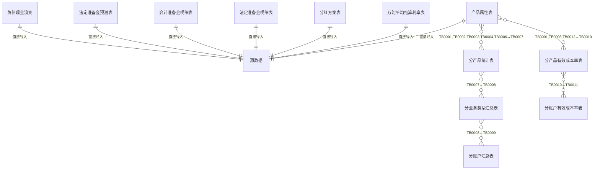
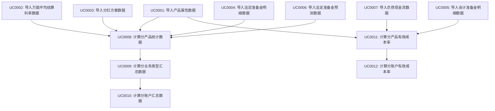
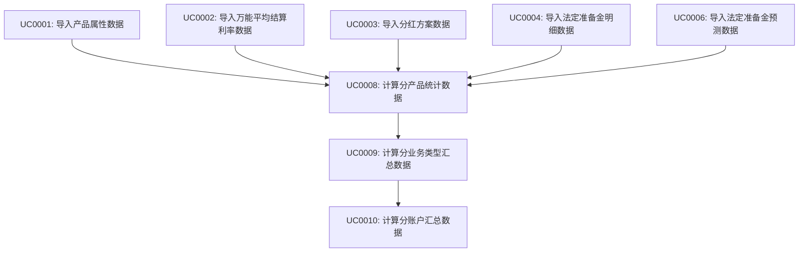
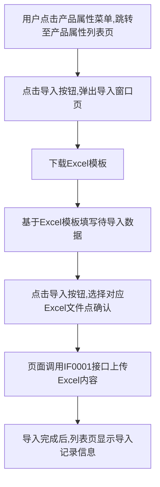
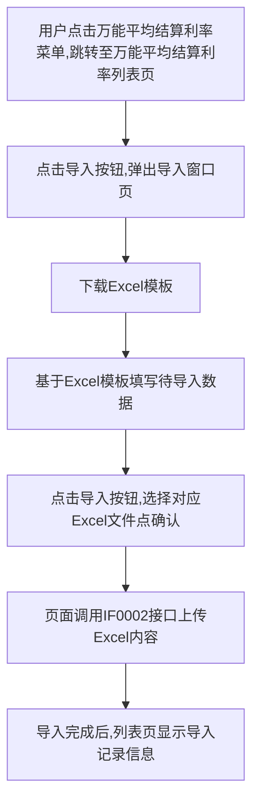
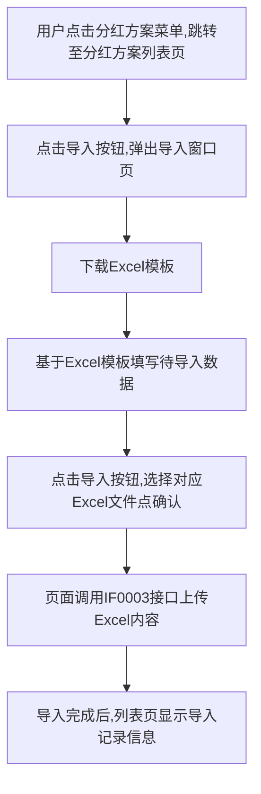
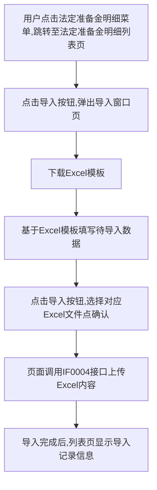
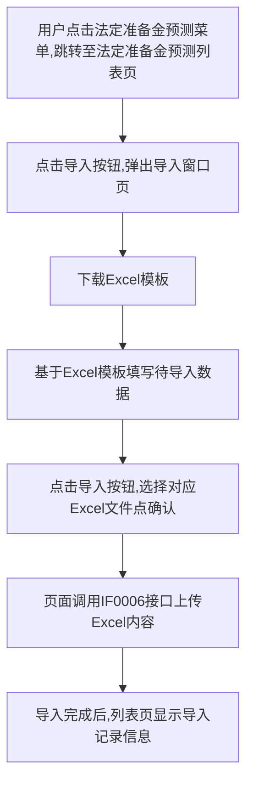
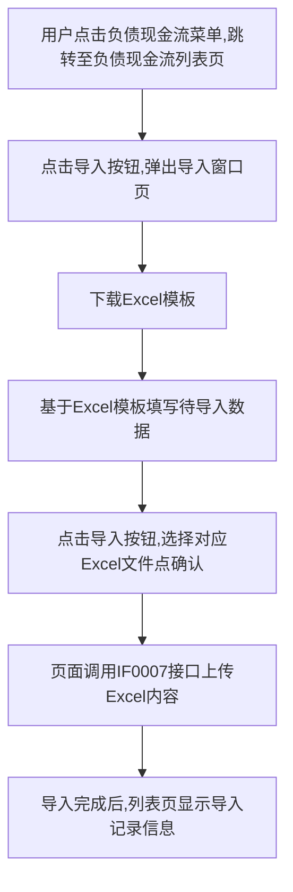
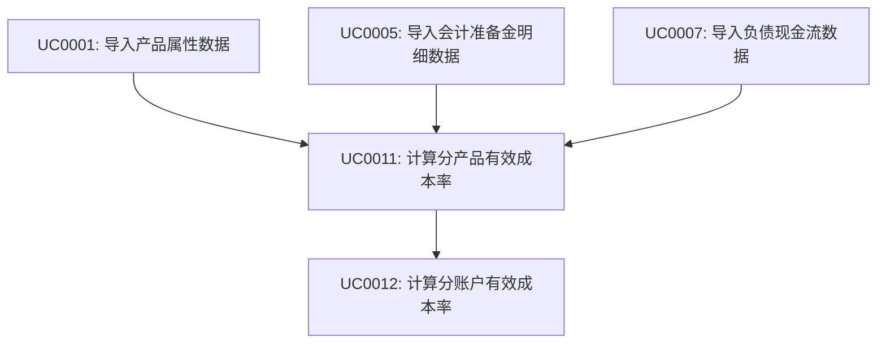

# 需求规格说明书模板

## 文档信息

| 项目名称 | 【需求名称】 |
| -------- | ------------ |
| 文档版本 | V1.0         |
| 作者     |        |
| 创建日期 | 2025-04-29   |
| 状态     | 已确认       |

## 变更履历

| 版本 | 日期       | 变更描述 | 修订人 | 审核 |
| ---- | ---------- | -------- | ------ | ---- |
| V1.0 | 2025-04-29 | 初次编写 |  | 通过 |

## 1. 需求概述

### 1.1 需求背景

先忽略

### 1.2 需求目标

先忽略

### 1.3 需求范围

先忽略

### 1.4 相关干系人

| 角色       | 部门 | 姓名 | 职责 |
| ---------- | ---- | ---- | ---- |
| 产品负责人 |      |      |      |
| 业务负责人 |      |      |      |
| 技术负责人 |      |      |      |

## 2. 业务架构

### 2.1 业务模块关系图

无

### 2.2 模块列表

| 模块编号 | 模块名称 | 模块英文名 | 英文缩写 |
| -------- | -------- | ---------- | -------- |
| MD0001 | 基础数据管理 | base_data_management | bdm |
| MD0002 | 负债成本率计算 | liability_cost_rate_calculation | lcrc |

#### 2.2.1 模块说明

**基础数据管理(MD0001)**：

- 产品属性表(t_product_attribute)：管理产品基本信息和保证成本率
- 万能平均结算利率表(t_universal_avg_settlement_rate)：管理万能险产品的结算利率
- 分红方案表(t_dividend_fund_cost_rate)：管理分红险产品的分红比例和投资收益率
- 法定准备金明细表(t_statutory_reserve_detail)：管理法定准备金数据
- 会计准备金明细表(t_accounting_reserve_detail)：管理会计准备金数据
- 法定准备金预测表(t_statutory_reserve_forecast)：管理准备金预测数据

**负债成本率计算(MD0002)**：

- 分产品统计表(t_product_statistics)：按产品汇总统计数据
- 分业务类型汇总表(t_business_type_summary)：按业务类型汇总数据
- 分账户汇总表(t_account_summary)：按账户汇总数据
- 分产品有效成本率表(t_product_effective_cost_rate)：计算各产品的有效成本率
- 分账户有效成本率表(t_account_effective_cost_rate)：计算各账户的有效成本率

### 2.3 数据模型

#### 2.3.1 表间关系

#### 2.3.2 表名字典

| 表编号 | 表中文名 | 表英文名 | 所属模块 | 备注 |
| ---- | ------ | ---- | ------ | ------ |
| TB0001 | 产品属性表 | t_product_attribute | MD0001 | 基础产品信息 |
| TB0002 | 万能平均结算利率表 | t_universal_avg_settlement_rate | MD0001 | 万能险结算利率 |
| TB0003 | 分红方案表 | t_dividend_fund_cost_rate | MD0001 | 分红险分红方案 |
| TB0004 | 法定准备金明细表 | t_statutory_reserve_detail | MD0001 | 法定准备金数据 |
| TB0005 | 会计准备金明细表 | t_accounting_reserve_detail | MD0001 | 会计准备金数据 |
| TB0006 | 法定准备金预测表 | t_statutory_reserve_forecast | MD0001 | 准备金预测数据 |
| TB0007 | 分产品统计表 | t_cost_product_statistics | MD0002 | 产品统计数据 |
| TB0008 | 分业务类型汇总表 | t_cost_business_type_summary | MD0002 | 业务类型汇总 |
| TB0009 | 分账户汇总表 | t_cost_account_summary | MD0002 | 账户汇总数据 |
| TB0010 | 分产品有效成本率表 | t_cost_product_effective_rate | MD0002 | 存储各产品的有效成本率计算结果 |
| TB0011 | 分账户有效成本率表 | t_cost_account_effective_rate | MD0002 | 存储按账户汇总的有效成本率 |
| TB0012 | 负债现金流表 | t_liability_cashflows | MD0001 | 负债现金流明细 |

#### 2.3.3 表集

##### 2.3.3.1 产品属性表(TB0001)

**表英文名**：t_product_attribute
**表中文名**：产品属性表
**所属模块**：基础数据管理(MD0001)
**表描述**：存储产品基本信息、分类信息和保证成本率等基础数据

**字段列表**：

| 字段名称 | 字段代码 | 数据类型 | 长度 | 是否可空 | 输入格式 | 缺省值 | 字段规则描述 | 唯一索引 | 备注 |
|----------|----------|----------|------|----------|----------|--------|--------------|----------|------|
| 主键ID | id | bigint | 20 | 否 | auto_increment | - | 自增主键 | PK | - |
| 账期 | accounting_period | varchar | 6 | 否 | YYYYMM | - | 账期 | 是 | - |
| 精算代码 | actuarial_code | varchar | 20 | 否 | letter+number | - | 产品精算代码，以字母开头 | 是 | - |
| 业务代码 | business_code | varchar | 20 | 否 | letter+number | - | 产品业务代码 | - | - |
| 产品名称 | product_name | varchar | 100 | 否 | - | - | 产品全称 | - | - |
| 长短期标识 | term_type | char | 1 | 否 | radio | 'L' | L-长期，S-短期 | - | - |
| 险种主类 | insurance_main_type | varchar | 50 | 否 | select | - | 如：长期寿险 | - | - |
| 险种细类 | insurance_sub_type | varchar | 50 | 否 | select | - | 如：年金险、两全险、附加两全险等 | - | - |
| 设计类型 | design_type | varchar | 50 | 否 | select | - | 如：传统险、分红险、万能险、投连险 | - | - |
| 是否中短 | short_term_flag | char | 1 | 否 | radio | 'N' | Y-是，N-否 | - | - |
| 报监管中短标识 | reg_mid_id | char | 1 | 否 | radio | 'N' | Y-是，N-否 | - | - |
| 定价保证成本率 | guaranteed_cost_rate | decimal | 10,6 | 是 | percentage | 0 | 以小数形式存储，如0.03表示3% | - | - |
| 子账户 | sub_account | varchar | 50 | 是 | select | - | 如：分红账户1、万能账户5等 | - | - |
| 新业务标识 | new_business_flag | char | 1 | 是 | radio | 'Y' | Y-是，N-否 | - | - |
| 备注 | remark | varchar | 500 | 是 | - | - | 产品相关补充说明 | - | - |
| 创建者 | create_by | varchar | 64 | 是 | - | - | 创建者 | - | - |
| 创建时间 | create_time | datetime | - | 是 | - | - | 创建时间 | - | - |
| 更新者 | update_by | varchar | 64 | 是 | - | - | 更新者 | - | - |
| 更新时间 | update_time | datetime | - | 是 | - | - | 更新时间 | - | - |
| 是否删除 | is_del | tinyint | 1 | 否 | - | 0 | 是否删除，0:否，1:是 | - | - |

**数据示例**：

| id | accounting_period | actuarial_code | business_code | product_name | term_type | insurance_main_type | insurance_sub_type | design_type | short_term_flag | reg_mid_id | guaranteed_cost_rate | sub_account | new_business_flag | remark | create_by | create_time | update_by | update_time | is_del |
|----|-------------------|----------------|---------------|--------------|-----------|---------------------|-------------------|------------|-----------------|-----------|----------------------|------------|------------------|--------|-----------|------------|-----------|------------|--------|
| 1 | 202506 | U413102 | 413101 | 弘康易理财年金保险（投资连结型） | L | 长期寿险 | 附加两全险 | 投连险 | Y | Y | 0 | 万能账户5 | Y | 业务代码与精算代码不一致。 | admin | 2025/6/1 10:00 | admin | 2025/6/1 10:00 | 0 |
| 2 | 202506 | U314405 | 514401 | 弘康弘乐一号年金保险（万能型） | S | 长期寿险 | 年金险 | 万能险 | N | N | 0.03 | 分红账户1 | N | 业务代码与精算代码不一致。 | admin | 2025/6/1 10:00 | admin | 2025/6/1 10:00 | 0 |

##### 2.3.3.2 万能平均结算利率表(TB0002)

**表英文名**：t_universal_avg_settlement_rate
**表中文名**：万能平均结算利率表
**所属模块**：基础数据管理(MD0001)
**表描述**：存储万能险产品的平均结算利率数据，用于成本率计算

**字段列表**：

| 字段名称 | 字段代码 | 数据类型 | 长度 | 是否可空 | 输入格式 | 缺省值 | 字段规则描述 | 唯一索引 | 备注 |
|----------|----------|----------|------|----------|----------|--------|--------------|----------|------|
| ID | id | bigint | 20 | 否 | 数值 | - | 自增主键 | 是 | - |
| 账期 | accounting_period | varchar | 6 | 否 | 文本 | - | 格式：YYYYMM（如202506） | 是 | 标识业务账期 |
| 精算代码 | actuarial_code | varchar | 20 | 否 | 文本 | - | 产品精算代码，以字母开头 | 是 | 唯一标识 |
| 业务代码 | business_code | varchar | 20 | 否 | 文本 | - | 产品业务代码 | 否 | - |
| 产品名称 | product_name | varchar | 100 | 否 | 文本 | - | 产品全称 | 否 | - |
| 是否中短 | short_term_flag | char | 1 | 否 | 文本 | N | 值域：Y-是，N-否 | 否 | - |
| 定价保证成本率 | guaranteed_cost_rate | decimal | 10,10 | 是 | 数值 | 0 | 以小数形式存储，如0.03表示3% | 否 | - |
| 平均结息利率T0 | avg_rate_t0 | decimal | 10,10 | 是 | 数值 | 0 | 评估时点平均结息利率 | 否 | - |
| 平均结息利率T1 | avg_rate_t1 | decimal | 10,10 | 是 | 数值 | 0 | 未来第1年末平均结息利率 | 否 | - |
| 平均结息利率T2 | avg_rate_t2 | decimal | 10,10 | 是 | 数值 | 0 | 未来第2年末平均结息利率 | 否 | - |
| 平均结息利率T3 | avg_rate_t3 | decimal | 10,10 | 是 | 数值 | 0 | 未来第3年末平均结息利率 | 否 | - |
| 创建者 | create_by | varchar | 64 | 是 | 文本 | - | - | 否 | - |
| 创建时间 | create_time | datetime | - | 是 | 日期时间 | - | - | 否 | - |
| 更新者 | update_by | varchar | 64 | 是 | 文本 | - | - | 否 | - |
| 更新时间 | update_time | datetime | - | 是 | 日期时间 | - | - | 否 | - |
| 备注 | remark | varchar | 500 | 是 | 文本 | - | - | 否 | - |
| 是否删除 | is_del | tinyint | 1 | 否 | 数值 | 0 | 0:否，1:是 | 否 | - |

**数据示例**：

| id | accounting_period | actuarial_code | business_code | product_name | short_term_flag | guaranteed_cost_rate | avg_rate_t0 | avg_rate_t1 | avg_rate_t2 | avg_rate_t3 | create_by | create_time | update_by | update_time | remark | is_del |
|----|-------------------|----------------|---------------|--------------|-----------------|----------------------|-------------|-------------|-------------|-------------|-----------|------------|-----------|------------|--------|--------|
| 1 | 202506 | U314403 | 314403 | 弘康安鑫保二号年金保险（万能型） | Y | 0.03 | 0.032169 | 0.03 | 0.03 | 0.03 | admin | 2025/6/1 10:00 | admin | 2025/6/1 10:00 | - | 0 |
| 2 | 202506 | U314205 | 314205 | 弘康安鑫保三号两全保险（万能型） | N | 0.03 | 0.031002 | 0.03 | 0.03 | 0.03 | admin | 2025/6/1 10:00 | admin | 2025/6/1 10:00 | - | 0 |

##### 2.3.3.3 分红方案表(TB0003)

**表英文名**：t_dividend_fund_cost_rate
**表中文名**：分红方案表
**所属模块**：基础数据管理(MD0001)
**表描述**：存储分红险产品的分红比例和投资收益率等信息，用于成本率计算

**字段列表**：

| 字段名称 | 字段代码 | 数据类型 | 长度 | 是否可空 | 输入格式 | 缺省值 | 字段规则描述 | 唯一索引 | 备注 |
|----------|----------|----------|------|----------|----------|--------|--------------|----------|------|
| ID | id | bigint | 20 | 否 | 数值 | - | 自增主键 | 是 | - |
| 账期 | accounting_period | varchar | 6 | 否 | 文本 | - | 格式：YYYYMM（如202506） | 是 | 标识业务账期 |
| 精算代码 | actuarial_code | varchar | 20 | 否 | 文本 | - | 产品精算代码，以字母开头 | 是 | 唯一标识 |
| 业务代码 | business_code | varchar | 20 | 否 | 文本 | - | 产品业务代码 | 否 | - |
| 产品名称 | product_name | varchar | 100 | 否 | 文本 | - | 产品全称 | 否 | - |
| 是否中短 | short_term_flag | char | 1 | 否 | 文本 | N | 值域：Y-是，N-否 | 否 | - |
| 定价保证成本率 | guaranteed_cost_rate | decimal | 10,10 | 是 | 数值 | 0 | 以小数形式存储，如0.03表示3% | 否 | - |
| 投资收益率假设 | investment_return_rate | decimal | 10,10 | 是 | 数值 | 0 | 投资收益率假设 | 否 | - |
| 分红比例 | dividend_ratio | decimal | 10,10 | 是 | 数值 | 0 | 分红比例 | 否 | - |
| 资金成本率T0 | fund_cost_rate_t0 | decimal | 10,10 | 是 | 数值 | 0 | 评估时点资金成本率 | 否 | - |
| 资金成本率T1 | fund_cost_rate_t1 | decimal | 10,10 | 是 | 数值 | 0 | 未来第1年末资金成本率 | 否 | - |
| 资金成本率T2 | fund_cost_rate_t2 | decimal | 10,10 | 是 | 数值 | 0 | 未来第2年末资金成本率 | 否 | - |
| 资金成本率T3 | fund_cost_rate_t3 | decimal | 10,10 | 是 | 数值 | 0 | 未来第3年末资金成本率 | 否 | - |
| 创建者 | create_by | varchar | 64 | 是 | 文本 | - | - | 否 | - |
| 创建时间 | create_time | datetime | - | 是 | 日期时间 | - | - | 否 | - |
| 更新者 | update_by | varchar | 64 | 是 | 文本 | - | - | 否 | - |
| 更新时间 | update_time | datetime | - | 是 | 日期时间 | - | - | 否 | - |
| 备注 | remark | varchar | 500 | 是 | 文本 | - | - | 否 | - |
| 是否删除 | is_del | tinyint | 1 | 否 | 数值 | 0 | 0:否，1:是 | 否 | - |

**数据示例**：

| id | accounting_period | actuarial_code | business_code | product_name | short_term_flag | guaranteed_cost_rate | investment_return_rate | dividend_ratio | fund_cost_rate_t0 | fund_cost_rate_t1 | fund_cost_rate_t2 | fund_cost_rate_t3 | create_by | create_time | update_by | update_time | remark | is_del |
|----|-------------------|----------------|---------------|--------------|-----------------|----------------------|------------------------|----------------|-------------------|-------------------|-------------------|-------------------|-----------|------------|-----------|------------|--------|--------|
| 1 | 202506 | C412201 | 312204 | 弘康常稳赢两全保险（分红型） | N | 0.03 | 0.0304 | 0.7 | 0.03028 | 0.03028 | 0.03028 | 0.03028 | admin | 2025/6/1 10:00 | admin | 2025/6/1 10:00 | - | 0 |
| 2 | 202506 | C312205 | 312205 | 弘康安弘赢两全保险（分红型） | Y | 0.03 | 0.0304 | 0.7 | 0.03028 | 0.03028 | 0.03028 | 0.03028 | admin | 2025/6/1 10:00 | admin | 2025/6/1 10:00 | - | 0 |

##### 2.3.3.4 法定准备金明细表(TB0004)

**表英文名**：t_statutory_reserve_detail
**表中文名**：法定准备金明细表
**所属模块**：基础数据管理(MD0001)
**表描述**：存储法定准备金数据，用于成本率计算和准备金预测

**字段列表**：

| 字段名称 | 字段代码 | 数据类型 | 长度 | 是否可空 | 输入格式 | 缺省值 | 字段规则描述 | 唯一索引 | 备注 |
|----------|----------|----------|------|----------|----------|--------|--------------|----------|------|
| ID | id | bigint | 20 | 否 | 数值 | - | 自增主键 | 是 | - |
| 账期 | accounting_period | varchar | 6 | 否 | 文本 | - | 格式：YYYYMM（如202506） | 是 | 标识业务账期 |
| 精算代码 | actuarial_code | varchar | 20 | 否 | 文本 | - | 产品精算代码，以字母开头 | 是 | 唯一标识 |
| 业务代码 | business_code | varchar | 20 | 否 | 文本 | - | 产品业务代码 | 否 | - |
| 产品名称 | product_name | varchar | 100 | 否 | 文本 | - | 产品全称 | 否 | - |
| 长短期标识 | term_type | char | 1 | 否 | 文本 | L | 值域：L-长期，S-短期 | 否 | - |
| 设计类型 | design_type | varchar | 50 | 否 | 文本 | - | 值域：传统险、分红险、万能险、投连险 | 否 | - |
| 是否中短 | short_term_flag | char | 1 | 否 | 文本 | N | 值域：Y-是，N-否 | 否 | - |
| 有效保单件数 | valid_policy_count | int | 11 | 是 | 数值 | 0 | 有效保单件数 | 否 | - |
| 存量累计规模保费 | accumulated_premium | decimal | 18,10 | 是 | 数值 | 0 | 存量累计规模保费 | 否 | - |
| 账户价值 | account_value | decimal | 18,10 | 是 | 数值 | 0 | 账户价值 | 否 | - |
| 法定/非单位准备金 | statutory_reserve | decimal | 18,10 | 是 | 数值 | 0 | 法定/非单位准备金 | 否 | - |
| 保证利率准备金 | guaranteed_rate_reserve | decimal | 18,10 | 是 | 数值 | 0 | 保证利率准备金 | 否 | - |
| 失效单现价 | lapsed_policy_value | decimal | 18,10 | 是 | 数值 | 0 | 失效单现价 | 否 | - |
| 豁免责任准备金 | waiver_reserve | decimal | 18,10 | 是 | 数值 | 0 | 豁免责任准备金 | 否 | - |
| 未建模准备金 | unmodeled_reserve | decimal | 18,10 | 是 | 数值 | 0 | 未建模准备金 | 否 | - |
| 持续奖准备金 | persistence_bonus_reserve | decimal | 18,10 | 是 | 数值 | 0 | 持续奖准备金 | 否 | - |
| 长期未到期准备金 | long_term_unearned | decimal | 18,10 | 是 | 数值 | 0 | 长期未到期准备金 | 否 | - |
| 短险未到期准备金 | short_term_unearned | decimal | 18,10 | 是 | 数值 | 0 | 短险未到期准备金 | 否 | - |
| 未到期责任准备金 | unearned_premium_reserve | decimal | 18,10 | 是 | 数值 | 0 | 未到期责任准备金 | 否 | - |
| 已报未决赔款 | reported_unpaid | decimal | 18,10 | 是 | 数值 | 0 | 已报未决赔款 | 否 | - |
| 未报未决赔款 | incurred_unreported | decimal | 18,10 | 是 | 数值 | 0 | 未报未决赔款 | 否 | - |
| 理赔费用准备金 | claim_expense_reserve | decimal | 18,10 | 是 | 数值 | 0 | 理赔费用准备金 | 否 | - |
| 未决赔款准备金 | outstanding_claim_reserve | decimal | 18,10 | 是 | 数值 | 0 | 未决赔款准备金 | 否 | - |
| 法定准备金合计 | total_statutory_reserve | decimal | 18,10 | 是 | 数值 | 0 | 法定准备金合计 | 否 | - |
| 创建者 | create_by | varchar | 64 | 是 | 文本 | - | - | 否 | - |
| 创建时间 | create_time | datetime | - | 是 | 日期时间 | - | - | 否 | - |
| 更新者 | update_by | varchar | 64 | 是 | 文本 | - | - | 否 | - |
| 更新时间 | update_time | datetime | - | 是 | 日期时间 | - | - | 否 | - |
| 备注 | remark | varchar | 500 | 是 | 文本 | - | - | 否 | - |
| 是否删除 | is_del | tinyint | 1 | 否 | 数值 | 0 | 0:否，1:是 | 否 | - |

**数据示例**：

| id | accounting_period | actuarial_code | business_code | product_name | term_type | design_type | short_term_flag | valid_policy_count | accumulated_premium | account_value | statutory_reserve | guaranteed_rate_reserve | lapsed_policy_value | waiver_reserve | unmodeled_reserve | persistence_bonus_reserve | long_term_unearned | short_term_unearned | unearned_premium_reserve | reported_unpaid | incurred_unreported | claim_expense_reserve | outstanding_claim_reserve | total_statutory_reserve | create_by | create_time | update_by | update_time | remark | is_del |
|----|-------------------|----------------|---------------|--------------|-----------|------------|-----------------|-------------------|---------------------|---------------|-------------------|------------------------|---------------------|----------------|-------------------|---------------------------|-------------------|--------------------|--------------------------|-----------------|--------------------|----------------------|----------------------------|------------------------|-----------|------------|-----------|------------|--------|--------|
| 1 | 202506 | U413208 | 413208 | 弘康安溢保两全保险（投资连结型） | L | 投连险 | Y | 63980 | 3848104847 | 4789052733 | 7605518.45 | 0 | 0 | 0 | 0 | 0 | 7605518.45 | 0 | 7605518.45 | 0 | 392838.26 | 15713.53 | 408551.79 | 8014070.25 | admin | 2025/6/1 10:00 | admin | 2025/6/1 10:00 | - | 0 |
| 2 | 202506 | U413402 | 413402 | 弘康恒享长盈年金保险（投资连结型） | S | 投连险 | N | 508274 | 2397715020 | 2461852596 | 18661550.79 | 0 | 0 | 0 | 0 | 20339056.75 | 39000607.54 | 0 | 39000607.54 | 0 | 27633.31 | 1105.33 | 28738.65 | 39029346.18 | admin | 2025/6/1 10:00 | admin | 2025/6/1 10:00 | - | 0 |

##### 2.3.3.5 会计准备金明细表(TB0005)

**表英文名**：t_accounting_reserve_detail
**表中文名**：会计准备金明细表
**所属模块**：基础数据管理(MD0001)
**表描述**：存储各产品的会计准备金明细数据，包括最优估计、风险边际、剩余边际等

**字段列表**：

| 字段名称 | 字段代码 | 数据类型 | 长度 | 是否可空 | 输入格式 | 缺省值 | 字段规则描述 | 唯一索引 | 备注 |
|----------|----------|----------|------|----------|----------|--------|--------------|----------|------|
| ID | id | bigint | 20 | 否 | 数值 | - | 自增主键 | 是 | - |
| 账期 | accounting_period | varchar | 6 | 否 | 文本 | - | 格式：YYYYMM（如202506） | 是 | 标识业务账期 |
| 精算代码 | actuarial_code | varchar | 20 | 否 | 文本 | - | 产品精算代码，以字母开头 | 是 | 唯一标识 |
| 业务代码 | business_code | varchar | 20 | 否 | 文本 | - | 产品业务代码 | 否 | - |
| 产品名称 | product_name | varchar | 100 | 否 | 文本 | - | 产品全称 | 否 | - |
| 长短期标识 | term_type | char | 1 | 否 | 文本 | L | 值域：L-长期，S-短期 | 否 | - |
| 设计类型 | design_type | varchar | 50 | 否 | 文本 | - | 值域：传统险、分红险、万能险、投连险 | 否 | - |
| 是否中短 | short_term_flag | char | 1 | 否 | 文本 | N | 值域：Y-是，N-否 | 否 | - |
| 有效保单件数 | valid_policy_count | int | 11 | 是 | 数值 | 0 | 有效保单件数 | 否 | - |
| 存量累计规模保费 | accumulated_premium | decimal | 18,10 | 是 | 数值 | 0 | 存量累计规模保费 | 否 | - |
| 账户价值 | account_value | decimal | 18,10 | 是 | 数值 | 0 | 账户价值 | 否 | - |
| 红利预提 | dividend_provision | decimal | 18,10 | 是 | 数值 | 0 | 红利预提 | 否 | - |
| 最优估计 | best_estimate | decimal | 18,10 | 是 | 数值 | 0 | 最优估计 | 否 | - |
| 风险边际 | risk_margin | decimal | 18,10 | 是 | 数值 | 0 | 风险边际 | 否 | - |
| 剩余边际 | residual_margin | decimal | 18,10 | 是 | 数值 | 0 | 剩余边际 | 否 | - |
| 未建模准备金 | unmodeled_reserve | decimal | 18,10 | 是 | 数值 | 0 | 未建模准备金 | 否 | - |
| 豁免准备金 | waiver_reserve | decimal | 18,10 | 是 | 数值 | 0 | 豁免准备金 | 否 | - |
| 持续奖准备金 | persistence_bonus_reserve | decimal | 18,10 | 是 | 数值 | 0 | 持续奖准备金 | 否 | - |
| 长期险未到期 | long_term_unearned | decimal | 18,10 | 是 | 数值 | 0 | 长期险未到期准备金 | 否 | - |
| 短险未到期 | short_term_unearned | decimal | 18,10 | 是 | 数值 | 0 | 短险未到期准备金 | 否 | - |
| 未到期责任准备金 | unearned_premium_reserve | decimal | 18,10 | 是 | 数值 | 0 | 未到期责任准备金 | 否 | - |
| 已报未决 | reported_unpaid | decimal | 18,10 | 是 | 数值 | 0 | 已报未决赔款 | 否 | - |
| 未报未决 | incurred_unreported | decimal | 18,10 | 是 | 数值 | 0 | 未报未决赔款 | 否 | - |
| 理赔费用准备金 | claim_expense_reserve | decimal | 18,10 | 是 | 数值 | 0 | 理赔费用准备金 | 否 | - |
| 未决赔款准备金 | outstanding_claim_reserve | decimal | 18,10 | 是 | 数值 | 0 | 未决赔款准备金 | 否 | - |
| 会计准备金合计 | total_accounting_reserve | decimal | 18,10 | 是 | 数值 | 0 | 会计准备金合计 | 否 | - |
| 应收分保未到期责任准备金 | reinsurance_unearned | decimal | 18,10 | 是 | 数值 | 0 | 应收分保未到期责任准备金 | 否 | - |
| 应收分保已报未决 | reinsurance_reported | decimal | 18,10 | 是 | 数值 | 0 | 应收分保已报未决 | 否 | - |
| 应收分保未报未决 | reinsurance_unreported | decimal | 18,10 | 是 | 数值 | 0 | 应收分保未报未决 | 否 | - |
| 应收分保未决合计 | reinsurance_claim_total | decimal | 18,10 | 是 | 数值 | 0 | 应收分保未决合计 | 否 | - |
| 应收分保合计 | reinsurance_total | decimal | 18,10 | 是 | 数值 | 0 | 应收分保合计 | 否 | - |
| 失效保单现价 | lapsed_policy_value | decimal | 18,10 | 是 | 数值 | 0 | 失效保单现价 | 否 | - |
| 零头月红利 | fractional_month_dividend | decimal | 18,10 | 是 | 数值 | 0 | 零头月红利 | 否 | - |
| 应付未付红利 | unpaid_dividend | decimal | 18,10 | 是 | 数值 | 0 | 应付未付红利 | 否 | - |
| 创建者 | create_by | varchar | 64 | 是 | 文本 | - | - | 否 | - |
| 创建时间 | create_time | datetime | - | 是 | 日期时间 | - | - | 否 | - |
| 更新者 | update_by | varchar | 64 | 是 | 文本 | - | - | 否 | - |
| 更新时间 | update_time | datetime | - | 是 | 日期时间 | - | - | 否 | - |
| 备注 | remark | varchar | 500 | 是 | 文本 | - | - | 否 | - |
| 是否删除 | is_del | tinyint | 1 | 否 | 数值 | 0 | 0:否，1:是 | 否 | - |

**数据示例**：

| id | accounting_period | actuarial_code | business_code | product_name | term_type | design_type | short_term_flag | valid_policy_count | accumulated_premium | account_value | dividend_provision | best_estimate | risk_margin | residual_margin | unmodeled_reserve | waiver_reserve | persistence_bonus_reserve | long_term_unearned | short_term_unearned | unearned_premium_reserve | reported_unpaid | incurred_unreported | claim_expense_reserve | outstanding_claim_reserve | total_accounting_reserve | reinsurance_unearned | reinsurance_reported | reinsurance_unreported | reinsurance_claim_total | reinsurance_total | lapsed_policy_value | fractional_month_dividend | unpaid_dividend | create_by | create_time | update_by | update_time | remark | is_del |
|----|-------------------|----------------|---------------|--------------|-----------|-------------|-----------------|-------------------|---------------------|--------------|-------------------|---------------|-------------|-----------------|-------------------|----------------|--------------------------|-------------------|---------------------|--------------------------|----------------|---------------------|----------------------|---------------------------|--------------------------|----------------------|---------------------|------------------------|--------------------------|-------------------|---------------------|----------------------------|-----------------|-----------|------------|-----------|------------|--------|--------|
| 1 | 202506 | U524401 | 524401 | 弘康喜洋洋养老年金保险（万能型） | L | 万能险 | Y | 52607 | 1704231 | 1921823.93 | 0 | 0 | 0 | 0 | 0 | 0 | 18750.06 | 18750.06 | 0 | 18750.06 | 0 | 1.44 | 0.06 | 1.5 | 18751.56 | 0 | 0 | 0 | 0 | 0 | 0 | 0 | 0 | admin | 2025/6/1 10:00 | admin | 2025/6/1 10:00 | - | 0 |
| 2 | 202506 | C511407 | 511407 | 弘康相伴长久年金保险 | S | 传统险 | N | 51650 | 382919122.2 | 0 | 0 | 61539769.53 | 1741944.66 | 25079409.09 | 0 | 0 | 0 | 123555716.2 | 0 | 123555716.2 | 53685.56 | 32973.44 | 3466.36 | 90125.36 | 123645841.5 | 0 | 0 | 0 | 0 | 0 | 35194592.88 | 0 | 0 | admin | 2025/6/1 10:00 | admin | 2025/6/1 10:00 | - | 0 |

##### 2.3.3.6 法定准备金预测表(TB0006)

**表英文名**：t_statutory_reserve_forecast
**表中文名**：法定准备金预测表
**所属模块**：基础数据管理(MD0001)
**表描述**：存储各产品未来三年的法定准备金预测数据，用于成本率计算

**字段列表**：

| 字段名称 | 字段代码 | 数据类型 | 长度 | 是否可空 | 输入格式 | 缺省值 | 字段规则描述 | 唯一索引 | 备注 |
|----------|----------|----------|------|----------|----------|--------|--------------|----------|------|
| ID | id | bigint | 20 | 否 | 数值 | - | 自增主键 | 是 | - |
| 业务类型 | business_type | varchar | 20 | 否 | 文本 | - | 值域：有效业务/新业务 | 是 | - |
| 账期 | accounting_period | varchar | 6 | 否 | 文本 | - | 格式：YYYYMM（如202506） | 是 | 标识业务账期 |
| 精算代码 | actuarial_code | varchar | 20 | 否 | 文本 | - | 产品精算代码，以字母开头 | 是 | 唯一标识 |
| 业务代码 | business_code | varchar | 20 | 否 | 文本 | - | 产品业务代码 | 否 | - |
| 产品名称 | product_name | varchar | 100 | 否 | 文本 | - | 产品全称 | 否 | - |
| 设计类型 | design_type | varchar | 50 | 否 | 文本 | - | 值域：传统险、分红险、万能险、投连险 | 否 | - |
| 是否中短 | short_term_flag | char | 1 | 否 | 文本 | N | 值域：Y-是，N-否 | 否 | - |
| 法定准备金T1 | statutory_reserve_t1 | decimal | 18,10 | 是 | 数值 | 0 | 未来第1年末法定准备金 | 否 | - |
| 法定准备金T2 | statutory_reserve_t2 | decimal | 18,10 | 是 | 数值 | 0 | 未来第2年末法定准备金 | 否 | - |
| 法定准备金T3 | statutory_reserve_t3 | decimal | 18,10 | 是 | 数值 | 0 | 未来第3年末法定准备金 | 否 | - |
| 创建者 | create_by | varchar | 64 | 是 | 文本 | - | - | 否 | - |
| 创建时间 | create_time | datetime | - | 是 | 日期时间 | - | - | 否 | - |
| 更新者 | update_by | varchar | 64 | 是 | 文本 | - | - | 否 | - |
| 更新时间 | update_time | datetime | - | 是 | 日期时间 | - | - | 否 | - |
| 备注 | remark | varchar | 500 | 是 | 文本 | - | - | 否 | - |
| 是否删除 | is_del | tinyint | 1 | 否 | 数值 | 0 | 0:否，1:是 | 否 | - |

**数据示例**：

| id | business_type | accounting_period | actuarial_code | business_code | product_name | design_type | short_term_flag | statutory_reserve_t1 | statutory_reserve_t2 | statutory_reserve_t3 | create_by | create_time | update_by | update_time | remark | is_del |
|----|---------------|-------------------|----------------|---------------|--------------|-------------|-----------------|----------------------|----------------------|----------------------|-----------|------------|-----------|------------|--------|--------|
| 1 | 有效业务 | 202506 | C511516 | 511516 | 弘康爱倍至（至尊版）重大疾病保险 | 传统险 | N | 2403685.6 | 3098903.85 | 3735559.01 | admin | 2025/6/1 10:00 | admin | 2025/6/1 10:00 | - | 0 |
| 2 | 有效业务 | 202506 | C511508 | 511508 | 弘康爱倍至重大疾病保险 | 分红险 | Y | 290622300.6 | 304784640 | 317804941 | admin | 2025/6/1 10:00 | admin | 2025/6/1 10:00 | - | 0 |
| 3 | 新业务 | 202506 | C411701 | 411701 | 弘康爱无忧恶性肿瘤疾病保险 | 万能险 | N | 10778081.65 | 12798679.77 | 14591447.6 | admin | 2025/6/1 10:00 | admin | 2025/6/1 10:00 | - | 0 |

##### 2.3.3.7 分产品统计表(TB0007)

**表英文名**：t_product_statistics
**表中文名**：分产品统计表
**所属模块**：负债成本率计算(MD0002)
**表描述**：存储各产品的统计数据和成本率计算结果，是成本率计算的核心表

**字段列表**：

| 字段名称 | 字段代码 | 数据类型 | 长度 | 是否可空 | 输入格式 | 缺省值 | 字段规则描述 | 唯一索引 | 备注 |
|----------|----------|----------|------|----------|----------|--------|--------------|----------|------|
| ID | id | bigint | 20 | 否 | 数值 | - | 自增主键 | 是 | - |
| 情景名称 | scenario_name | varchar | 50 | 否 | 文本 | - | 如：基本情景、压力情景三 | 是 | - |
| 业务类型 | business_type | varchar | 20 | 否 | 文本 | - | 值域：有效业务/新业务 | 是 | - |
| 账期 | accounting_period | varchar | 6 | 否 | 文本 | - | 格式：YYYYMM（如202506） | 是 | 标识业务账期 |
| 精算代码 | actuarial_code | varchar | 20 | 否 | 文本 | - | 产品精算代码，以字母开头 | 是 | 唯一标识 |
| 业务代码 | business_code | varchar | 20 | 否 | 文本 | - | 产品业务代码 | 否 | - |
| 产品名称 | product_name | varchar | 100 | 否 | 文本 | - | 产品全称 | 否 | - |
| 长短期标识 | term_type | char | 1 | 否 | 文本 | L | 值域：L-长期，S-短期 | 否 | - |
| 设计类型 | design_type | varchar | 50 | 否 | 文本 | - | 值域：传统险、分红险、万能险、投连险 | 否 | - |
| 是否中短 | short_term_flag | char | 1 | 否 | 文本 | N | 值域：Y-是，N-否 | 否 | - |
| 法定准备金T0 | statutory_reserve_t0 | decimal | 18,10 | 是 | 数值 | 0 | 当前法定准备金 | 否 | - |
| 法定准备金T1 | statutory_reserve_t1 | decimal | 18,10 | 是 | 数值 | 0 | 未来第1年末法定准备金 | 否 | - |
| 法定准备金T2 | statutory_reserve_t2 | decimal | 18,10 | 是 | 数值 | 0 | 未来第2年末法定准备金 | 否 | - |
| 法定准备金T3 | statutory_reserve_t3 | decimal | 18,10 | 是 | 数值 | 0 | 未来第3年末法定准备金 | 否 | - |
| 资金成本率T0 | fund_cost_rate_t0 | decimal | 10,10 | 是 | 数值 | 0 | 当前资金成本率 | 否 | - |
| 资金成本率T1 | fund_cost_rate_t1 | decimal | 10,10 | 是 | 数值 | 0 | 未来第1年末资金成本率 | 否 | - |
| 资金成本率T2 | fund_cost_rate_t2 | decimal | 10,10 | 是 | 数值 | 0 | 未来第2年末资金成本率 | 否 | - |
| 资金成本率T3 | fund_cost_rate_t3 | decimal | 10,10 | 是 | 数值 | 0 | 未来第3年末资金成本率 | 否 | - |
| 保证成本率T0 | guaranteed_cost_rate_t0 | decimal | 10,10 | 是 | 数值 | 0 | 当前保证成本率 | 否 | - |
| 保证成本率T1 | guaranteed_cost_rate_t1 | decimal | 10,10 | 是 | 数值 | 0 | 未来第1年末保证成本率 | 否 | - |
| 保证成本率T2 | guaranteed_cost_rate_t2 | decimal | 10,10 | 是 | 数值 | 0 | 未来第2年末保证成本率 | 否 | - |
| 保证成本率T3 | guaranteed_cost_rate_t3 | decimal | 10,10 | 是 | 数值 | 0 | 未来第3年末保证成本率 | 否 | - |
| 创建者 | create_by | varchar | 64 | 是 | 文本 | - | - | 否 | - |
| 创建时间 | create_time | datetime | - | 是 | 日期时间 | - | - | 否 | - |
| 更新者 | update_by | varchar | 64 | 是 | 文本 | - | - | 否 | - |
| 更新时间 | update_time | datetime | - | 是 | 日期时间 | - | - | 否 | - |
| 备注 | remark | varchar | 500 | 是 | 文本 | - | - | 否 | - |
| 是否删除 | is_del | tinyint | 1 | 否 | 数值 | 0 | 0:否，1:是 | 否 | - |

**数据示例**：

| id | scenario_name | business_type | accounting_period | actuarial_code | business_code | product_name | term_type | design_type | short_term_flag | statutory_reserve_t0 | statutory_reserve_t1 | statutory_reserve_t2 | statutory_reserve_t3 | fund_cost_rate_t0 | fund_cost_rate_t1 | fund_cost_rate_t2 | fund_cost_rate_t3 | guaranteed_cost_rate_t0 | guaranteed_cost_rate_t1 | guaranteed_cost_rate_t2 | guaranteed_cost_rate_t3 | create_by | create_time | update_by | update_time | remark | is_del |
|----|---------------|---------------|-------------------|----------------|---------------|--------------|-----------|-------------|-----------------|----------------------|----------------------|----------------------|----------------------|-------------------|-------------------|-------------------|-------------------|--------------------------|--------------------------|--------------------------|--------------------------|-----------|------------|-----------|------------|--------|--------|
| 1 | 基本情景 | 有效业务 | 202506 | U413102 | 413101 | 弘康易理财年金保险 | L | 传统险 | Y | 8014070.25 | 8014070.25 | 8014070.25 | 8014070.25 | 0.03 | 0.03 | 0.03 | 0.03 | 0.03 | 0.03 | 0.03 | 0.03 | admin | 2025/6/1 10:00 | admin | 2025/6/1 10:00 | - | 0 |
| 2 | 基本情景 | 有效业务 | 202506 | U314405 | 514401 | 弘康弘乐一号年金保险 | L | 万能险 | N | 39029346.18 | 39029346.18 | 39029346.18 | 39029346.18 | 0.03 | 0.03 | 0.03 | 0.03 | 0.03 | 0.03 | 0.03 | 0.03 | admin | 2025/6/1 10:00 | admin | 2025/6/1 10:00 | - | 0 |
| 3 | 基本情景 | 新业务 | 202506 | U514202 | 324201 | 弘康附加安鑫赢三号两全保险 | L | 分红险 | Y | 269363426.1 | 269363426.1 | 269363426.1 | 269363426.1 | 0.03 | 0.03 | 0.03 | 0.03 | 0.03 | 0.03 | 0.03 | 0.03 | admin | 2025/6/1 10:00 | admin | 2025/6/1 10:00 | - | 0 |
| 1 | 压力情景三 | 有效业务 | 202506 | U413102 | 413101 | 弘康易理财年金保险 | L | 传统险 | Y | 8014070.25 | 8014070.25 | 8014070.25 | 8014070.25 | 0.03 | 0.03 | 0.03 | 0.03 | 0.03 | 0.03 | 0.03 | 0.03 | admin | 2025/6/1 10:00 | admin | 2025/6/1 10:00 | - | 0 |
| 2 | 压力情景三 | 有效业务 | 202506 | U314405 | 514401 | 弘康弘乐一号年金保险 | L | 万能险 | N | 39029346.18 | 39029346.18 | 39029346.18 | 39029346.18 | 0.03 | 0.03 | 0.03 | 0.03 | 0.03 | 0.03 | 0.03 | 0.03 | admin | 2025/6/1 10:00 | admin | 2025/6/1 10:00 | - | 0 |
| 3 | 压力情景三 | 新业务 | 202506 | U514202 | 324201 | 弘康附加安鑫赢三号两全保险 | L | 分红险 | Y | 269363426.1 | 269363426.1 | 269363426.1 | 269363426.1 | 0.03 | 0.03 | 0.03 | 0.03 | 0.03 | 0.03 | 0.03 | 0.03 | admin | 2025/6/1 10:00 | admin | 2025/6/1 10:00 | - | 0 |

##### 2.3.3.8 分业务类型汇总表(TB0008)

**表英文名**：t_business_type_summary
**表中文名**：分业务类型汇总表
**所属模块**：负债成本率计算(MD0002)
**表描述**：按业务类型汇总统计数据，用于成本率计算和报表展示

**字段列表**：

| 字段名称 | 字段代码 | 数据类型 | 长度 | 是否可空 | 输入格式 | 缺省值 | 字段规则描述 | 唯一索引 | 备注 |
|----------|----------|----------|------|----------|----------|--------|--------------|----------|------|
| ID | id | bigint | 20 | 否 | 数值 | - | 自增主键 | 是 | - |
| 情景名称 | scenario_name | varchar | 50 | 否 | 文本 | - | 如：基本情景、压力情景三 | 是 | - |
| 业务类型 | business_type | varchar | 20 | 否 | 文本 | - | 值域：有效业务/新业务 | 是 | - |
| 账期 | accounting_period | varchar | 6 | 否 | 文本 | - | 格式：YYYYMM（如202506） | 是 | 标识业务账期 |
| 设计类型 | design_type | varchar | 50 | 否 | 文本 | - | 值域：传统险、分红险、万能险、投连险 | 是 | - |
| 法定准备金T0 | statutory_reserve_t0 | decimal | 18,10 | 是 | 数值 | 0 | 评估时点法定准备金 | 否 | - |
| 法定准备金T1 | statutory_reserve_t1 | decimal | 18,10 | 是 | 数值 | 0 | 未来第1年末法定准备金 | 否 | - |
| 法定准备金T2 | statutory_reserve_t2 | decimal | 18,10 | 是 | 数值 | 0 | 未来第2年末法定准备金 | 否 | - |
| 法定准备金T3 | statutory_reserve_t3 | decimal | 18,10 | 是 | 数值 | 0 | 未来第3年末法定准备金 | 否 | - |
| 资金成本率T0 | fund_cost_rate_t0 | decimal | 10,10 | 是 | 数值 | 0 | 评估时点资金成本率 | 否 | - |
| 资金成本率T1 | fund_cost_rate_t1 | decimal | 10,10 | 是 | 数值 | 0 | 未来第1年末资金成本率 | 否 | - |
| 资金成本率T2 | fund_cost_rate_t2 | decimal | 10,10 | 是 | 数值 | 0 | 未来第2年末资金成本率 | 否 | - |
| 资金成本率T3 | fund_cost_rate_t3 | decimal | 10,10 | 是 | 数值 | 0 | 未来第3年末资金成本率 | 否 | - |
| 保证成本率T0 | guaranteed_cost_rate_t0 | decimal | 10,10 | 是 | 数值 | 0 | 评估时点保证成本率 | 否 | - |
| 保证成本率T1 | guaranteed_cost_rate_t1 | decimal | 10,10 | 是 | 数值 | 0 | 未来第1年末保证成本率 | 否 | - |
| 保证成本率T2 | guaranteed_cost_rate_t2 | decimal | 10,10 | 是 | 数值 | 0 | 未来第2年末保证成本率 | 否 | - |
| 保证成本率T3 | guaranteed_cost_rate_t3 | decimal | 10,10 | 是 | 数值 | 0 | 未来第3年末保证成本率 | 否 | - |
| 创建者 | create_by | varchar | 64 | 是 | 文本 | - | - | 否 | - |
| 创建时间 | create_time | datetime | - | 是 | 日期时间 | - | - | 否 | - |
| 更新者 | update_by | varchar | 64 | 是 | 文本 | - | - | 否 | - |
| 更新时间 | update_time | datetime | - | 是 | 日期时间 | - | - | 否 | - |
| 备注 | remark | varchar | 500 | 是 | 文本 | - | - | 否 | - |
| 是否删除 | is_del | tinyint | 1 | 否 | 数值 | 0 | 0:否，1:是 | 否 | - |

**数据示例**：

| id | scenario_name | business_type | accounting_period | design_type | statutory_reserve_t0 | statutory_reserve_t1 | statutory_reserve_t2 | statutory_reserve_t3 | fund_cost_rate_t0 | fund_cost_rate_t1 | fund_cost_rate_t2 | fund_cost_rate_t3 | guaranteed_cost_rate_t0 | guaranteed_cost_rate_t1 | guaranteed_cost_rate_t2 | guaranteed_cost_rate_t3 | create_by | create_time | update_by | update_time | remark | is_del |
|----|---------------|---------------|-------------------|-------------|----------------------|----------------------|----------------------|----------------------|-------------------|-------------------|-------------------|-------------------|--------------------------|--------------------------|--------------------------|--------------------------|-----------|------------|-----------|------------|--------|--------|
| 1 | 基本情景 | 有效业务 | 202506 | 传统险 | 8014070.25 | 8014070.25 | 8014070.25 | 8014070.25 | 0.03 | 0.03 | 0.03 | 0.03 | 0.03 | 0.03 | 0.03 | 0.03 | admin | 2025/6/1 10:00 | admin | 2025/6/1 10:00 | - | 0 |
| 2 | 压力情景三 | 新业务 | 202506 | 传统险 | 39029346.18 | 39029346.18 | 39029346.18 | 39029346.18 | 0.03 | 0.03 | 0.03 | 0.03 | 0.03 | 0.03 | 0.03 | 0.03 | admin | 2025/6/1 10:00 | admin | 2025/6/1 10:00 | - | 0 |

##### 2.3.3.9 分账户汇总表(TB0009)

**表英文名**：t_account_summary
**表中文名**：分账户汇总表
**所属模块**：负债成本率计算(MD0002)
**表描述**：按账户汇总统计数据，用于成本率计算和报表展示

**字段列表**：

| 字段名称 | 字段代码 | 数据类型 | 长度 | 是否可空 | 输入格式 | 缺省值 | 字段规则描述 | 唯一索引 | 备注 |
|----------|----------|----------|------|----------|----------|--------|--------------|----------|------|
| ID | id | bigint | 20 | 否 | 数值 | - | 自增主键 | 是 | - |
| 情景名称 | scenario_name | varchar | 50 | 否 | 文本 | - | 如：基本情景、压力情景三 | 是 | - |
| 账期 | accounting_period | varchar | 6 | 否 | 文本 | - | 格式：YYYYMM（如202506） | 是 | 标识业务账期 |
| 设计类型 | design_type | varchar | 50 | 否 | 文本 | - | 值域：传统险、分红险、万能险、投连险 | 是 | - |
| 法定准备金T0 | statutory_reserve_t0 | decimal | 18,10 | 是 | 数值 | 0 | 评估时点法定准备金 | 否 | - |
| 法定准备金T1 | statutory_reserve_t1 | decimal | 18,10 | 是 | 数值 | 0 | 未来第1年末法定准备金 | 否 | - |
| 法定准备金T2 | statutory_reserve_t2 | decimal | 18,10 | 是 | 数值 | 0 | 未来第2年末法定准备金 | 否 | - |
| 法定准备金T3 | statutory_reserve_t3 | decimal | 18,10 | 是 | 数值 | 0 | 未来第3年末法定准备金 | 否 | - |
| 资金成本率T0 | fund_cost_rate_t0 | decimal | 10,10 | 是 | 数值 | 0 | 评估时点资金成本率 | 否 | - |
| 资金成本率T1 | fund_cost_rate_t1 | decimal | 10,10 | 是 | 数值 | 0 | 未来第1年末资金成本率 | 否 | - |
| 资金成本率T2 | fund_cost_rate_t2 | decimal | 10,10 | 是 | 数值 | 0 | 未来第2年末资金成本率 | 否 | - |
| 资金成本率T3 | fund_cost_rate_t3 | decimal | 10,10 | 是 | 数值 | 0 | 未来第3年末资金成本率 | 否 | - |
| 保证成本率T0 | guaranteed_cost_rate_t0 | decimal | 10,10 | 是 | 数值 | 0 | 评估时点保证成本率 | 否 | - |
| 保证成本率T1 | guaranteed_cost_rate_t1 | decimal | 10,10 | 是 | 数值 | 0 | 未来第1年末保证成本率 | 否 | - |
| 保证成本率T2 | guaranteed_cost_rate_t2 | decimal | 10,10 | 是 | 数值 | 0 | 未来第2年末保证成本率 | 否 | - |
| 保证成本率T3 | guaranteed_cost_rate_t3 | decimal | 10,10 | 是 | 数值 | 0 | 未来第3年末保证成本率 | 否 | - |
| 创建者 | create_by | varchar | 64 | 是 | 文本 | - | - | 否 | - |
| 创建时间 | create_time | datetime | - | 是 | 日期时间 | - | - | 否 | - |
| 更新者 | update_by | varchar | 64 | 是 | 文本 | - | - | 否 | - |
| 更新时间 | update_time | datetime | - | 是 | 日期时间 | - | - | 否 | - |
| 备注 | remark | varchar | 500 | 是 | 文本 | - | - | 否 | - |
| 是否删除 | is_del | tinyint | 1 | 否 | 数值 | 0 | 0:否，1:是 | 否 | - |

**数据示例**：

| id | scenario_name | accounting_period | design_type | statutory_reserve_t0 | statutory_reserve_t1 | statutory_reserve_t2 | statutory_reserve_t3 | fund_cost_rate_t0 | fund_cost_rate_t1 | fund_cost_rate_t2 | fund_cost_rate_t3 | guaranteed_cost_rate_t0 | guaranteed_cost_rate_t1 | guaranteed_cost_rate_t2 | guaranteed_cost_rate_t3 | create_by | create_time | update_by | update_time | remark | is_del |
|----|---------------|-------------------|-------------|----------------------|----------------------|----------------------|----------------------|-------------------|-------------------|-------------------|-------------------|--------------------------|--------------------------|--------------------------|--------------------------|-----------|------------|-----------|------------|--------|--------|
| 1 | 基本情景 | 202506 | 传统险 | 8014070.25 | 8014070.25 | 8014070.25 | 8014070.25 | 0.03 | 0.03 | 0.03 | 0.03 | 0.03 | 0.03 | 0.03 | 0.03 | admin | 2025/6/1 10:00 | admin | 2025/6/1 10:00 | - | 0 |
| 2 | 基本情景 | 202506 | 万能险 | 39029346.18 | 39029346.18 | 39029346.18 | 39029346.18 | 0.03 | 0.03 | 0.03 | 0.03 | 0.03 | 0.03 | 0.03 | 0.03 | admin | 2025/6/1 10:00 | admin | 2025/6/1 10:00 | - | 0 |
| 3 | 压力情景三 | 202506 | 分红险 | 269363426.1 | 269363426.1 | 269363426.1 | 269363426.1 | 0.03 | 0.03 | 0.03 | 0.03 | 0.03 | 0.03 | 0.03 | 0.03 | admin | 2025/6/1 10:00 | admin | 2025/6/1 10:00 | - | 0 |
| 4 | 压力情景三 | 202506 | 普通账户 | 316406842.5 | 316406842.5 | 316406842.5 | 316406842.5 | 0.03 | 0.03 | 0.03 | 0.03 | 0.03 | 0.03 | 0.03 | 0.03 | admin | 2025/6/1 10:00 | admin | 2025/6/1 10:00 | - | 0 |

##### 2.3.3.10 分产品有效成本率表(TB0010)

**表英文名**：t_cost_product_effective_rate
**表中文名**：分产品有效成本率表
**所属模块**：负债成本率计算(MD0002)
**表描述**：存储各产品的有效成本率计算结果，包含现金流数据

**字段列表**：

| 字段名称 | 字段代码 | 数据类型 | 长度 | 是否可空 | 输入格式 | 缺省值 | 字段规则描述 | 唯一索引 | 备注 |
|----------|----------|----------|------|----------|----------|--------|--------------|----------|------|
| **id** | id | bigint | 20 | 否 | 数值 | - | 自增主键 | 是 | 系统字段 |
| **accounting_period** | accounting_period | varchar | 6 | 否 | 文本 | - | 格式：YYYYMM（如202506） | 是 | 标识业务账期 |
| **actuarial_code** | actuarial_code | varchar | 20 | 否 | 文本 | - | 产品精算代码，以字母开头 | 是 | 唯一标识 |
| **design_type** | design_type | varchar | 50 | 否 | 文本 | - | 值域：传统险、分红险、万能险、投连险 | 是 | - |
| **short_term_flag** | short_term_flag | char | 1 | 否 | 文本 | 'N' | 值域：Y-是，N-否 | 是 | 标识产品期限 |
| business_code | business_code | varchar | 20 | 否 | 文本 | - | 产品业务代码 | 否 | - |
| product_name | product_name | varchar | 100 | 否 | 文本 | - | 产品全称 | 否 | - |
| effective_cost_rate | effective_cost_rate | decimal | 10,10 | 是 | 数值 | 0 | 产品有效成本率 | 否 | - |
| cash_flow_set | cash_flow_set | text | 65535 | 是 | 文本 | - | JSON格式存储现金流数据，格式：{"0": {"日期": "2023/06/30", "值": "2100"}, "1": {"日期": "2023/07/31", "值": "2100"}} | 否 | - |
| create_by | create_by | varchar | 64 | 是 | 文本 | - | 创建人员 | 否 | 系统字段 |
| create_time | create_time | datetime | - | 是 | 日期时间 | - | 创建时间 | 否 | 系统字段 |
| update_by | update_by | varchar | 64 | 是 | 文本 | - | 更新人员 | 否 | 系统字段 |
| update_time | update_time | datetime | - | 是 | 日期时间 | - | 更新时间 | 否 | 系统字段 |
| remark | remark | varchar | 500 | 是 | 文本 | - | 备注信息 | 否 | 系统字段 |
| is_del | is_del | tinyint | 1 | 否 | 数值 | 0 | 0:否，1:是 | 否 | 系统字段 |

**数据示例**：

| id | accounting_period | actuarial_code | business_code | product_name | design_type | short_term_flag | effective_cost_rate | cash_flow_set | create_by | create_time | update_by | update_time | remark | is_del |
|----|-------------------|----------------|---------------|--------------|-------------|-----------------|---------------------|--------------|-----------|------------|-----------|------------|--------|--------|
| 1 | 202506 | C311101 | 511516 | 弘康弘利年年终身寿险 | 传统险 | Y | 0.0334 | {"0": {"日期": "2023/06/30", "值": "2100"}, "1": {"日期": "2023/07/31", "值": "2100"}} | admin | 2025/6/1 10:00 | admin | 2025/6/1 10:00 | - | 0 |

##### 2.3.3.11 分账户有效成本率表(TB0011)

**表英文名**：t_cost_account_effective_rate
**表中文名**：分账户有效成本率表
**所属模块**：负债成本率计算(MD0002)
**表描述**：按账户汇总的有效成本率计算结果，用于成本率计算和报表展示

**字段列表**：

| 字段名称 | 字段代码 | 数据类型 | 长度 | 是否可空 | 输入格式 | 缺省值 | 字段规则描述 | 唯一索引 | 备注 |
|----------|----------|----------|------|----------|----------|--------|--------------|----------|------|
| **id** | id | bigint | 20 | 否 | 数值 | - | 自增主键 | 是 | 系统字段 |
| **accounting_period** | accounting_period | varchar | 6 | 否 | 文本 | - | 格式：YYYYMM（如202506） | 是 | 标识业务账期 |
| **design_type** | design_type | varchar | 50 | 否 | 文本 | - | 值域：传统险、分红险、万能险、投连险、普通账户 | 是 | 账户类型 |
| effective_cost_rate | effective_cost_rate | decimal | 10,10 | 是 | 数值 | 0 | 账户有效成本率 | 否 | - |
| cash_flow_set | cash_flow_set | text | 65535 | 否 | 文本 | - | JSON格式存储现金流数据，格式：{"0": {"日期": "2023/06/30", "值": "2100"}, "1": {"日期": "2023/07/31", "值": "2100"}} | 否 | - |
| create_by | create_by | varchar | 64 | 是 | 文本 | - | 创建人员 | 否 | 系统字段 |
| create_time | create_time | datetime | - | 是 | 日期时间 | - | 创建时间 | 否 | 系统字段 |
| update_by | update_by | varchar | 64 | 是 | 文本 | - | 更新人员 | 否 | 系统字段 |
| update_time | update_time | datetime | - | 是 | 日期时间 | - | 更新时间 | 否 | 系统字段 |
| remark | remark | varchar | 500 | 是 | 文本 | - | 备注信息 | 否 | 系统字段 |
| is_del | is_del | tinyint | 1 | 否 | 数值 | 0 | 0:否，1:是 | 否 | 系统字段 |

**数据示例**：

| id | accounting_period | design_type | effective_cost_rate | cash_flow_set | create_by | create_time | update_by | update_time | remark | is_del |
|----|-------------------|-------------|---------------------|---------------|-----------|------------|-----------|------------|--------|--------|
| 1 | 202506 | 传统险 | 0.0334 | {"0": {"日期": "2023/06/30", "值": "2100"}, "1": {"日期": "2023/07/31", "值": "2100"}} | admin | 2025/6/1 10:00 | admin | 2025/6/1 10:00 | - | 0 |
| 2 | 202506 | 分红险 | 0 | {"0": {"日期": "2023/06/30", "值": "2100"}, "1": {"日期": "2023/07/31", "值": "2100"}} | admin | 2025/6/1 10:00 | admin | 2025/6/1 10:00 | - | 0 |
| 3 | 202506 | 万能险 | 0.0334 | {"0": {"日期": "2023/06/30", "值": "2100"}, "1": {"日期": "2023/07/31", "值": "2100"}} | admin | 2025/6/1 10:00 | admin | 2025/6/1 10:00 | - | 0 |
| 4 | 202506 | 投连险 | 0.0285 | {"0": {"日期": "2023/06/30", "值": "3500"}, "1": {"日期": "2023/07/31", "值": "-150"}} | admin | 2025/6/1 10:00 | admin | 2025/6/1 10:00 | - | 0 |
| 5 | 202506 | 普通账户 | 0.0285 | {"0": {"日期": "2023/06/30", "值": "3500"}, "1": {"日期": "2023/07/31", "值": "-150"}} | admin | 2025/6/1 10:00 | admin | 2025/6/1 10:00 | - | 0 |

##### 2.3.3.12 负债现金流表(TB0012)

**表英文名**：t_liability_cashflows
**表中文名**：负债现金流表
**所属模块**：基础数据管理(MD0001)
**表描述**：存储各产品的负债现金流预测数据，用于成本率计算

**字段列表**：

| 字段名称 | 字段代码 | 数据类型 | 长度 | 是否可空 | 输入格式 | 缺省值 | 字段规则描述 | 唯一索引 | 备注 |
|----------|----------|----------|------|----------|----------|--------|--------------|----------|------|
| ID | id | bigint | 20 | 否 | 数值 | - | 主键，自增长 | 是 | 系统字段 |
| 创建者 | create_by | varchar | 64 | 是 | 文本 | - | 创建人员 | 否 | 系统字段 |
| 创建时间 | create_time | datetime | - | 是 | 日期时间 | - | 创建时间 | 否 | 系统字段 |
| 更新者 | update_by | varchar | 64 | 是 | 文本 | - | 更新人员 | 否 | 系统字段 |
| 更新时间 | update_time | datetime | - | 是 | 日期时间 | - | 更新时间 | 否 | 系统字段 |
| 备注 | remark | varchar | 500 | 是 | 文本 | - | 备注信息 | 否 | 系统字段 |
| 是否删除 | is_del | tinyint | 1 | 否 | 数值 | 0 | 0:否，1:是 | 否 | 系统字段 |
| 账期 | accounting_period | varchar | 6 | 否 | 文本 | - | 格式YYYYMM | 是 | 标识业务账期 |
| 现金流类型 | cash_flow_type | varchar | 20 | 否 | 文本 | - | 值域：流入、流出 | 是 | 标识现金流方向及利率情景 |
| 基点类型 | basis_point_type | varchar | 10 | 是 | 文本 | - | 值域：0bp、+50bp、-50bp（字典表配置） | 否 | - |
| 精算代码 | actuarial_code | varchar | 20 | 否 | 文本 | - | - | 是 | 关联精算模型 |
| 业务代码 | business_code | varchar | 20 | 否 | 文本 | - | - | 否 | 标识业务线 |
| 产品名称 | product_name | varchar | 100 | 否 | 文本 | - | - | 否 | 描述产品名称 |
| 现金流值集 | cash_flow_set | text | 65535 | 否 | 文本 | - | JSON格式存储预测现金流日期、期限、金额 | 否 | - |
| 久期类型 | duration_type | varchar | 20 | 否 | 文本 | - | 值域：修正久期、有效久期 | 是 | 标识久期类型 |
| 险种主类 | main_insurance_type | varchar | 50 | 否 | 文本 | - | - | 否 | 险种大类 |
| 险种细类 | detailed_insurance_type | varchar | 50 | 否 | 文本 | - | - | 否 | 险种子类 |
| 设计类型 | design_type | varchar | 50 | 否 | 文本 | - | - | 是 | 产品设计类型 |
| 是否中短 | short_term_flag | char | 1 | 否 | 文本 | 'N' | Y/N | 是 | 标识产品期限 |

**数据示例**：

| id | create_by | create_time | update_by | update_time | remark | is_del | accounting_period | cash_flow_type | basis_point_type | actuarial_code | business_code | product_name | cash_flow_set | duration_type | main_insurance_type | detailed_insurance_type | design_type | short_term_flag |
|----|-----------|------------|-----------|------------|--------|--------|-------------------|---------------|-----------------|----------------|---------------|--------------|--------------|--------------|---------------------|------------------------|-------------|-----------------|
| 1 | admin | 2023/6/1 10:00 | admin | 2023/6/1 10:00 | - | 0 | 202306 | 流入 | 0bp | ACT001 | BUS001 | 定期寿险产品A | {"0": {"日期": "2023/01/30", "值": "2100"}} | 修正久期 | 寿险 | 定期寿险 | 传统险 | Y |
| 2 | admin | 2023/6/1 10:00 | admin | 2023/6/1 10:00 | - | 0 | 202306 | 流出 | 0bp | ACT001 | BUS001 | 定期寿险产品A | {"2": {"日期": "2023/02/30", "值": "2100"}} | 修正久期 | 寿险 | 定期寿险 | 分红险 | Y |

### 2.4 用例列表

| 用例编号   | 用例名称             | 用例描述 | 模块编号 |
|--------|------------------| - | ---- |
| UC0001 | 导入产品属性数据        | 导入产品属性数据，写入TB0001表 | MD0002 |
| UC0002 | 导入万能平均结算利率数据         | 导入万能平均结算利率数据，写入TB0002表 | MD0002 |
| UC0003 | 导入分红方案数据         | 导入分红方案数据，写入TB0003表 | MD0002 |
| UC0004 | 导入法定准备金明细数据      | 导入法定准备金明细数据，写入TB0004表 | MD0002 |
| UC0005 | 导入会计准备金明细数据     | 导入会计准备金明细数据，写入TB0005表 | MD0002 |
| UC0006 | 导入法定准备金预测数据        | 导入法定准备金预测数据，写入TB0006表 | MD0002 |
| UC0007 | 导入负债现金流数据        | 导入负债现金流数据，写入TB0012表 | MD0002 |
| UC0008 | 计算分产品统计数据        | 计算分产品统计数据，写入TB0007表 | MD0002 |
| UC0009 | 计算分业务类型汇总数据      | 计算分业务类型汇总数据，写入TB0008表 | MD0002 |
| UC0010 | 计算分账户汇总数据      | 计算分账户汇总数据，写入TB0009表 | MD0002 |
| UC0011 | 计算分产品有效成本率     | 计算分产品有效成本率，写入TB0010表 | MD0002 |
| UC0012 | 计算分账户有效成本率     | 计算分账户有效成本率，写入TB0011表 | MD0002 |

### 2.5 接口清单

| 接口编号   | 接口名称        | 接口描述 | 模块编号 |
| ------ |-------------| ---- | ---- |
| IF0001 | 导入产品属性数据   | 导入产品属性数据，写入TB0001表 | MD0002 |
| IF0002 | 导入万能平均结算利率数据    | 导入万能平均结算利率数据，写入TB0002表 | MD0002 |
| IF0003 | 导入分红方案数据    | 导入分红方案数据，写入TB0003表 | MD0002 |
| IF0004 | 导入法定准备金明细数据 | 导入法定准备金明细数据，写入TB0004表 | MD0002 |
| IF0005 | 导入会计准备金明细数据 | 导入会计准备金明细数据，写入TB0005表 | MD0002 |
| IF0006 | 导入法定准备金预测数据 | 导入法定准备金预测数据，写入TB0006表 | MD0002 |
| IF0007 | 导入负债现金流数据 | 导入负债现金流数据，写入TB0012表 | MD0002 |

## 3. 业务概念与术语

| 术语      | 定义   | 业务含义   | 备注   |
| ------- | ---- | ------ | ---- |
| 【通用术语1】 | 【定义】 | 【业务含义】 | 【备注】 |
| 【通用术语2】 | 【定义】 | 【业务含义】 | 【备注】 |

## 4. 功能需求

### 4.1 负债成本率模块

#### 4.1.1 功能概要

负债成本率模块主要实现以下功能：
1. 导入基础数据（产品属性、万能平均结算利率、分红方案、法定准备金明细、会计准备金明细、法定准备金预测、负债现金流）
2. 计算资金成本率和保证成本率
3. 计算有效成本率
4. 汇总分析各类成本率数据

#### 4.1.2 业务总流程

#### 4.1.3 用例描述

##### 4.1.3.1 资金成本率和保证成本率计算

###### 4.1.3.1.1 功能概要

资金成本率和保证成本率计算主要通过以下步骤完成：
1. 导入基础数据（产品属性、万能平均结算利率、分红方案、法定准备金明细、法定准备金预测）
2. 计算分产品统计数据
3. 计算分业务类型汇总数据
4. 计算分账户汇总数据

###### 4.1.3.1.2 业务总流程

###### 4.1.3.1.3 用例描述

###### 4.1.3.1.3.1 导入产品属性数据(UC0001)

|   用例标识   | 用例描述             |
| :----------: | ------------------------------------ |
| 类型 | 服务 |
|   用例名称   | 导入产品属性数据                |
|   功能描述   | 导入产品属性数据 |
|    参与者    | 精算部人员                     |
|    原型图    | PT0001                                |
|    关联表    | TB0001                        |
|    前置用例    |                        |

###### 4.1.3.1.3.2 导入万能平均结算利率数据(UC0002)

|   用例标识   | 用例描述             |
| :----------: | ------------------------------------ |
| 类型 | 服务 |
|   用例名称   | 导入万能平均结算利率数据                |
|   功能描述   | 导入万能平均结算利率数据 |
|    参与者    | 精算部人员                     |
|    原型图    | PT0002                                |
|    关联表    | TB0002                        |
|    前置用例    |                        |

###### 4.1.3.1.3.3 导入分红方案数据(UC0003)

|   用例标识   | 用例描述             |
| :----------: | ------------------------------------ |
| 类型 | 服务 |
|   用例名称   | 导入分红方案数据                |
|   功能描述   | 导入分红方案数据 |
|    参与者    | 精算部人员                     |
|    原型图    | PT0003                                |
|    关联表    | TB0003                        |
|    前置用例    |                        |

###### 4.1.3.1.3.4 导入法定准备金明细数据(UC0004)

|   用例标识   | 用例描述             |
| :----------: | ------------------------------------ |
| 类型 | 服务 |
|   用例名称   | 导入法定准备金明细数据                |
|   功能描述   | 导入法定准备金明细数据 |
|    参与者    | 精算部人员                     |
|    原型图    | PT0004                                |
|    关联表    | TB0004                        |
|    前置用例    |                        |

###### 4.1.3.1.3.5 导入会计准备金明细数据(UC0005)

|   用例标识   | 用例描述             |
| :----------: | ------------------------------------ |
| 类型 | 服务 |
|   用例名称   | 导入会计准备金明细数据                |
|   功能描述   | 导入会计准备金明细数据 |
|    参与者    | 精算部人员                     |
|    原型图    | PT0005                                |
|    关联表    | TB0005                        |
|    前置用例    |                        |

###### 4.1.3.1.3.6 导入法定准备金预测数据(UC0006)

|   用例标识   | 用例描述             |
| :----------: | ------------------------------------ |
| 类型 | 服务 |
|   用例名称   | 导入法定准备金预测数据                |
|   功能描述   | 导入法定准备金预测数据 |
|    参与者    | 精算部人员                     |
|    原型图    | PT0006                                |
|    关联表    | TB0006                        |
|    前置用例    |                        |

###### 4.1.3.1.3.7 导入负债现金流数据(UC0007)

|   用例标识   | 用例描述             |
| :----------: | ------------------------------------ |
| 类型 | 服务 |
|   用例名称   | 导入负债现金流数据                |
|   功能描述   | 导入负债现金流数据 |
|    参与者    | 精算部人员                     |
|    原型图    | PT0007                                |
|    关联表    | TB0012                        |
|    前置用例    |                        |

###### 4.1.3.1.3.8 计算分产品统计数据(UC0008)

|   用例标识   | 用例描述             |
| :----------: | ------------------------------------ |
| 类型 | 批处理 |
|   用例名称   | 计算分产品统计数据                |
|   功能描述   | 计算分产品统计数据 |
|    参与者    | 系统                     |
|    原型图    |                                |
|    关联表    | TB0001,TB0002,TB0003,TB0004,TB0006,TB0007                        |
|    前置用例    | UC0001,UC0002,UC0003,UC0004,UC0006                       |

**步骤1.** 加载基础数据

(1) 按账期读取TB0001表(产品属性表)，构建产品属性HashMap，以便后面快速读取
(2) 按账期读取TB0002表(万能平均结算利率表)，构建万能平均结算利率HashMap，以便后面快速读取
(3) 按账期读取TB0003表(分红方案表)，构建分红方案HashMap，以便后面快速读取
(4) 按账期读取TB0004表(法定准备金明细表)，构建法定准备金明细HashMap，以便后面快速读取
(5) 按账期读取TB0006表(法定准备金预测表)，构建法定准备金预测HashMap，以便后面快速读取

**步骤2.** 计算分产品统计数据

(1) 筛选产品数据
   a. 从产品属性表(TB0001)中筛选设计类型为"传统险"、"分红险"、"万能险"的产品记录，不包含"投连险"
   b. 获取产品基本信息（账期、精算代码、业务代码、产品名称、长短期标识、设计类型、是否中短等）

(2) 确定业务类型
   a. 有效业务：
      - 设计类型为"传统险"、"分红险"、"万能险"的产品
      - 长短期标识为"长期"或"L"的产品
   b. 新业务：
      - 设计类型为"传统险"、"分红险"、"万能险"的产品
      - 长短期标识为"长期"或"L"的产品
      - 新业务标识为"是"或"Y"的产品

(3) 计算法定准备金
   a. 法定准备金T0计算规则：
      - 如果业务类型是"有效业务"，取自法定准备金明细表(TB0004)的账户价值字段+法定准备金合计字段，匹配字段为业务类型和精算代码
      - 如果业务类型为"新业务"，强制赋值为0
   b. 法定准备金T1、法定准备金T2、法定准备金T3计算规则：
      - 取自法定准备金预测表(TB0006)，匹配字段为业务类型和精算代码，分别取法定准备金T1、法定准备金T2、法定准备金T3字段

(4) 设置情景名称
   a. 默认情景名称为"基本情景"
   b. 系统复制基本情景的数据并修改情景类型为"压力情景三"

(5) 计算资金成本率T0和资金成本率T1（适用于基本情景和压力情景三）
   a. 如果设计类型为"传统险"，取自产品属性表(TB0001)的定价保证成本率字段，匹配字段为精算代码
   b. 如果设计类型为"分红险"，取自分红方案表(TB0003)的"资金成本率T0"和"资金成本率T1"字段，匹配字段为精算代码
   c. 如果设计类型为"万能险"，取自万能平均结算利率表(TB0002)的"平均结算利率T0"和"平均结算利率T1"字段，匹配字段为精算代码

(6) 计算资金成本率T2
   a. 基本情景：
      - 如果设计类型为"传统险"，取自产品属性表(TB0001)的定价保证成本率字段，匹配字段为精算代码
      - 如果设计类型为"分红险"，取自分红方案表(TB0003)的"资金成本率T2"字段，匹配字段为精算代码
      - 如果设计类型为"万能险"，取自万能平均结算利率表(TB0002)的"平均结算利率T2"字段，匹配字段为精算代码
   b. 压力情景三：
      - 如果设计类型为"传统险"：
        * 如果中短标识为"N"（非中短），取自产品属性表(TB0001)的定价保证成本率字段，匹配字段为精算代码
        * 如果中短标识为"Y"（中短），取自产品属性表(TB0001)的定价保证成本率字段+1%，匹配字段为精算代码
      - 如果设计类型为"分红险"，取自分红方案表(TB0003)的"资金成本率T2"字段+1%*"分红比例"字段，匹配字段为精算代码
      - 如果设计类型为"万能险"，取自万能平均结算利率表(TB0002)的"平均结算利率T2"字段+1%，匹配字段为精算代码

(7) 计算资金成本率T3
   a. 基本情景：
      - 如果设计类型为"传统险"，取自产品属性表(TB0001)的定价保证成本率字段，匹配字段为精算代码
      - 如果设计类型为"分红险"，取自分红方案表(TB0003)的"资金成本率T3"字段，匹配字段为精算代码
      - 如果设计类型为"万能险"，取自万能平均结算利率表(TB0002)的"平均结算利率T3"字段，匹配字段为精算代码
   b. 压力情景三：
      - 如果设计类型为"传统险"：
        * 如果中短标识为"N"（非中短），取自产品属性表(TB0001)的定价保证成本率字段，匹配字段为精算代码
        * 如果中短标识为"Y"（中短），取自产品属性表(TB0001)的定价保证成本率字段+2%，匹配字段为精算代码
      - 如果设计类型为"分红险"，取自分红方案表(TB0003)的"资金成本率T3"字段+2%*"分红比例"字段，匹配字段为精算代码
      - 如果设计类型为"万能险"，取自万能平均结算利率表(TB0002)的"平均结算利率T3"字段+2%，匹配字段为精算代码

(8) 计算保证成本率T0、保证成本率T1、保证成本率T2、保证成本率T3（适用于基本情景和压力情景三）
   a. 如果中短标识为"N"（非中短），取自产品属性表(TB0001)的定价保证成本率字段，匹配字段为精算代码
   b. 如果中短标识为"Y"（中短），等于对应情景下计算出的资金成本率T0、资金成本率T1、资金成本率T2、资金成本率T3

**步骤3.** 数据入表

(1) 将计算结果按照分产品统计表(TB0007)的结构组织数据
(2) 写入TB0007表

###### 4.1.3.1.3.9 计算分业务类型汇总数据(UC0009)

|   用例标识   | 用例描述             |
| :----------: | ------------------------------------ |
| 类型 | 批处理 |
|   用例名称   | 计算分业务类型汇总数据                |
|   功能描述   | 计算分业务类型汇总数据 |
|    参与者    | 系统                     |
|    原型图    |                                |
|    关联表    | TB0007,TB0008                        |
|    前置用例    | UC0008                       |

**步骤1.** 分产品统计数据汇总

(1) 按账期、情景名称、业务类型、设计类型维度对TB0007表数据进行分组
(2) 对每个分组执行以下操作：
   a. 计算法定准备金汇总值：
      - 法定准备金T0 = SUM(法定准备金T0)，匹配字段：情景名称、业务类型、账期、设计类型
      - 法定准备金T1 = SUM(法定准备金T1)，匹配字段：情景名称、业务类型、账期、设计类型
      - 法定准备金T2 = SUM(法定准备金T2)，匹配字段：情景名称、业务类型、账期、设计类型
      - 法定准备金T3 = SUM(法定准备金T3)，匹配字段：情景名称、业务类型、账期、设计类型
   b. 计算资金成本率加权平均值：
      - 资金成本率T0 = SUM(法定准备金T0*资金成本率T0)/SUM(法定准备金T0)，匹配字段：情景名称、业务类型、账期、设计类型
      - 资金成本率T1 = SUM(法定准备金T1*资金成本率T1)/SUM(法定准备金T1)，匹配字段：情景名称、业务类型、账期、设计类型
      - 资金成本率T2 = SUM(法定准备金T2*资金成本率T2)/SUM(法定准备金T2)，匹配字段：情景名称、业务类型、账期、设计类型
      - 资金成本率T3 = SUM(法定准备金T3*资金成本率T3)/SUM(法定准备金T3)，匹配字段：情景名称、业务类型、账期、设计类型
   c. 计算保证成本率加权平均值：
      - 保证成本率T0 = SUM(法定准备金T0*保证成本率T0)/SUM(法定准备金T0)，匹配字段：情景名称、业务类型、账期、设计类型
      - 保证成本率T1 = SUM(法定准备金T1*保证成本率T1)/SUM(法定准备金T1)，匹配字段：情景名称、业务类型、账期、设计类型
      - 保证成本率T2 = SUM(法定准备金T2*保证成本率T2)/SUM(法定准备金T2)，匹配字段：情景名称、业务类型、账期、设计类型
      - 保证成本率T3 = SUM(法定准备金T3*保证成本率T3)/SUM(法定准备金T3)，匹配字段：情景名称、业务类型、账期、设计类型

**步骤2.** 数据入表

(1) 将汇总结果按照分业务类型汇总表(TB0008)的结构组织数据
(2) 写入TB0008表

###### 4.1.3.1.3.10 计算分账户汇总数据(UC0010)

|   用例标识   | 用例描述             |
| :----------: | ------------------------------------ |
| 类型 | 批处理 |
|   用例名称   | 计算分账户汇总数据                |
|   功能描述   | 计算分账户汇总数据 |
|    参与者    | 系统                     |
|    原型图    |                                |
|    关联表    | TB0008,TB0009                        |
|    前置用例    | UC0009                       |

**步骤1.** 分业务类型汇总数据汇总

(1) 按账期、情景名称、设计类型维度对TB0008表数据进行分组（不再区分业务类型）
(2) 对每个分组执行以下操作：
   a. 计算法定准备金汇总值：
      - 法定准备金T0 = SUM(法定准备金T0)，匹配字段：情景名称、账期、设计类型
      - 法定准备金T1 = SUM(法定准备金T1)，匹配字段：情景名称、账期、设计类型
      - 法定准备金T2 = SUM(法定准备金T2)，匹配字段：情景名称、账期、设计类型
      - 法定准备金T3 = SUM(法定准备金T3)，匹配字段：情景名称、账期、设计类型
   b. 计算资金成本率加权平均值：
      - 资金成本率T0 = SUM(法定准备金T0*资金成本率T0)/SUM(法定准备金T0)，匹配字段：情景名称、账期、设计类型
      - 资金成本率T1 = SUM(法定准备金T1*资金成本率T1)/SUM(法定准备金T1)，匹配字段：情景名称、账期、设计类型
      - 资金成本率T2 = SUM(法定准备金T2*资金成本率T2)/SUM(法定准备金T2)，匹配字段：情景名称、账期、设计类型
      - 资金成本率T3 = SUM(法定准备金T3*资金成本率T3)/SUM(法定准备金T3)，匹配字段：情景名称、账期、设计类型
   c. 计算保证成本率加权平均值：
      - 保证成本率T0 = SUM(法定准备金T0*保证成本率T0)/SUM(法定准备金T0)，匹配字段：情景名称、账期、设计类型
      - 保证成本率T1 = SUM(法定准备金T1*保证成本率T1)/SUM(法定准备金T1)，匹配字段：情景名称、账期、设计类型
      - 保证成本率T2 = SUM(法定准备金T2*保证成本率T2)/SUM(法定准备金T2)，匹配字段：情景名称、账期、设计类型
      - 保证成本率T3 = SUM(法定准备金T3*保证成本率T3)/SUM(法定准备金T3)，匹配字段：情景名称、账期、设计类型

(3) 计算普通账户及公司整体数据
   a. 按账期、情景名称维度对步骤(2)的结果进行进一步处理，不再区分设计类型
   b. 计算普通账户数据：
      - 法定准备金T0 = SUM(传统险法定准备金T0 + 分红险法定准备金T0 + 万能险法定准备金T0)，匹配字段：情景名称、账期
      - 资金成本率T0 = (传统险法定准备金T0*传统险资金成本率T0 + 分红险法定准备金T0*分红险资金成本率T0 + 万能险法定准备金T0*万能险资金成本率T0)/(传统险法定准备金T0 + 分红险法定准备金T0 + 万能险法定准备金T0)，匹配字段：情景名称、账期
      - 保证成本率T0 = (传统险法定准备金T0*传统险保证成本率T0 + 分红险法定准备金T0*分红险保证成本率T0 + 万能险法定准备金T0*万能险保证成本率T0)/(传统险法定准备金T0 + 分红险法定准备金T0 + 万能险法定准备金T0)，匹配字段：情景名称、账期
      - 资金成本率T1、资金成本率T2、资金成本率T3、保证成本率T1、保证成本率T2、保证成本率T3默认为0，不参与计算
      - 法定准备金T1、法定准备金T2、法定准备金T3默认为0
   c. 设置普通账户记录：
      - 设计类型设置为"普通账户"
      - 其他字段按上述计算结果填充

**步骤2.** 数据入表

(1) 将汇总结果按照分账户汇总表(TB0009)的结构组织数据
(2) 写入TB0009表

##### 4.1.3.2 有效成本率计算

###### 4.1.3.2.1 功能概要

有效成本率计算主要通过以下步骤完成：
1. 导入基础数据（产品属性、会计准备金明细、负债现金流）
2. 计算分产品有效成本率
3. 计算分账户有效成本率

###### 4.1.3.2.2 业务总流程

###### 4.1.3.2.3 用例描述

###### 4.1.3.2.3.1 计算分产品有效成本率(UC0011)

|   用例标识   | 用例描述             |
| :----------: | ------------------------------------ |
| 类型 | 批处理 |
|   用例名称   | 计算分产品有效成本率                |
|   功能描述   | 计算分产品有效成本率 |
|    参与者    | 系统                     |
|    原型图    |                                |
|    关联表    | TB0001,TB0005,TB0012,TB0010                        |
|    前置用例    | UC0001,UC0005,UC0007                       |

**步骤1.** 加载基础数据

(1) 按账期读取TB0001表(产品属性表)，构建产品属性HashMap，以便后面快速读取
(2) 按账期读取TB0005表(会计准备金明细表)，构建会计准备金明细HashMap，以便后面快速读取
(3) 按账期读取TB0012表(负债现金流表)，构建负债现金流HashMap，以便后面快速读取

**步骤2.** 计算分产品有效成本率

(1) 遍历产品属性表中的产品记录，对每条记录执行以下操作：
   a. 获取产品基本信息（精算代码、业务代码、产品名称、设计类型、是否中短等）
   b. 根据精算代码从会计准备金明细HashMap中获取账面价值数据：
      - 账面价值 = 账户价值 + 最优估计 + 风险边际 + 剩余边际 + 持续奖准备金 + 零头月红利
   c. 根据精算代码从负债现金流HashMap中获取现金流数据
   d. 构建现金流值集：
      - 第0个元素为账面价值（负值）
      - 第1-1272个元素为业务净现金流（流出现金流*(-1) + 流入现金流）
   e. 计算有效成本率：
      - 如果未来期间现金流之和为0，有效成本率 = 0%
      - 否则，使用内部收益率(IRR)方法计算有效成本率，使得现金流现值等于账面价值

**步骤3.** 数据入表

(1) 将计算结果按照分产品有效成本率表(TB0010)的结构组织数据
(2) 写入TB0010表

###### 4.1.3.2.3.2 计算分账户有效成本率(UC0012)

|   用例标识   | 用例描述             |
| :----------: | ------------------------------------ |
| 类型 | 批处理 |
|   用例名称   | 计算分账户有效成本率                |
|   功能描述   | 计算分账户有效成本率 |
|    参与者    | 系统                     |
|    原型图    |                                |
|    关联表    | TB0010,TB0011                        |
|    前置用例    | UC0011                       |

**步骤1.** 分产品有效成本率汇总

(1) 按账期、设计类型维度对TB0010表数据进行分组
(2) 对每个分组执行以下操作：
   a. 汇总现金流值集，将同一设计类型的所有产品的现金流值集按对应序号累加
   b. 使用内部收益率(IRR)方法计算账户有效成本率，使得汇总后的现金流现值等于汇总后的账面价值

**步骤2.** 数据入表

(1) 将汇总结果按照分账户有效成本率表(TB0011)的结构组织数据
(2) 写入TB0011表
