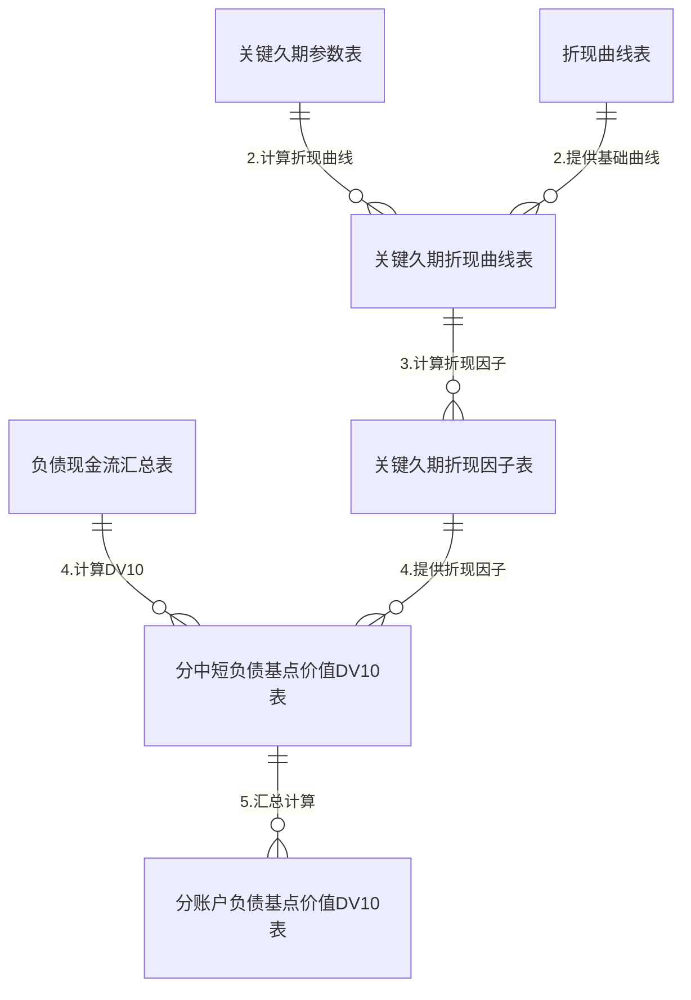
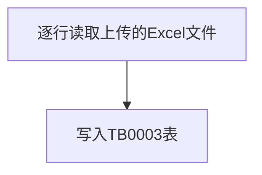
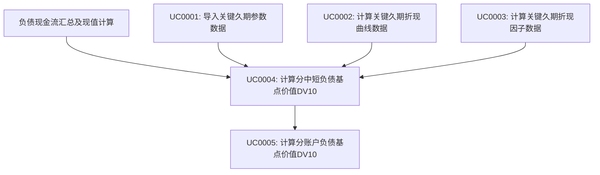
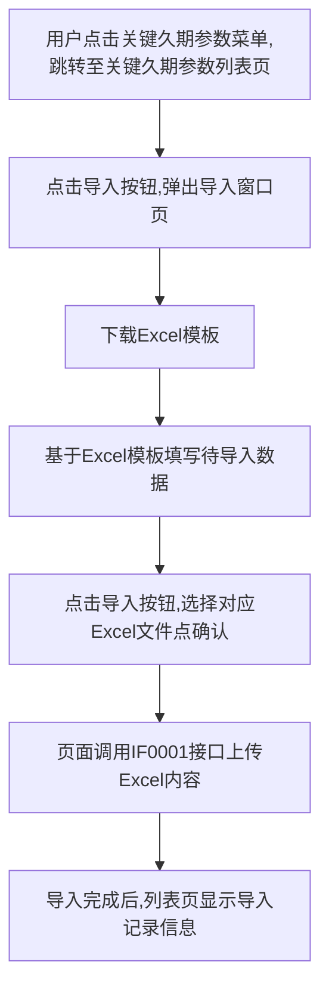

# 需求规格说明书模板

## 文档信息

| 项目名称 | 【需求名称】 |
| -------- | ------------ |
| 文档版本 | V1.0         |
| 作者     |        |
| 创建日期 | 2025-05-07   |
| 状态     | 已确认       |

## 变更履历

| 版本 | 日期       | 变更描述 | 修订人 | 审核 |
| ---- | ---------- | -------- | ------ | ---- |
| V1.0 | 2025-05-07 | 初次编写 |  | 通过 |

## 1. 需求概述

### 1.1 需求背景

先忽略

### 1.2 需求目标

先忽略

### 1.3 需求范围

先忽略

### 1.4 相关干系人

| 角色       | 部门 | 姓名 | 职责 |
| ---------- | ---- | ---- | ---- |
| 产品负责人 |      |      |      |
| 业务负责人 |      |      |      |
| 技术负责人 |      |      |      |

## 2. 业务架构

### 2.1 业务模块关系图

无

### 2.2 模块列表

| 模块编号 | 模块名称 | 模块英文名 | 英文缩写 |
| -------- | -------- | ---------- | -------- |
| MD0001   | 久期     | duration   | dur      |
| MD0002   | 负债     | liability  | liab     |

### 2.3 数据模型

#### 2.3.1 久期模块
##### 2.3.1.1 表间关系


##### 2.3.1.2 表名字典
| 表编号 | 表中文名 | 表英文名 | 备注 |
| ---- | ------ | ---- | ------ |
| TB0001 | 折现曲线表 | t_dur_discount_curve | 存储折现曲线数据（来源于duration_program_design.md中的TB0002） |
| TB0002 | 负债现金流汇总表 | t_dur_liability_cash_flow_summary | 存储负债现金流现值汇总数据（来源于duration_program_design.md中的TB0005） |
| TB0003 | 关键久期参数表 | t_dur_key_duration_parameter | 存储关键久期计算所需的参数 |
| TB0004 | 关键久期折现曲线表 | t_dur_key_duration_discount_curve | 存储关键久期计算所需的折现曲线 |
| TB0005 | 关键久期折现因子表 | t_dur_key_duration_discount_factors | 存储关键久期计算所需的折现因子 |
| TB0006 | 分中短负债基点价值DV10表 | t_dur_liability_dv10_by_duration | 存储按久期分类的负债基点价值 |
| TB0007 | 分账户负债基点价值DV10表 | t_dur_account_liability_dv10 | 存储按账户分类的负债基点价值 |

##### 2.3.1.3 表集

##### （1）TB0001 折现曲线表
*注：此表来源于duration_program_design.md中的TB0002，此处不再详细定义*

##### （2）TB0002 负债现金流汇总表
*注：此表来源于duration_program_design.md中的TB0005，此处不再详细定义*

##### （3）TB0003 关键久期参数表

| 字段名             | 数据类型 | 长度  | 允许空 | 唯一索引 | 默认值 | 说明                                                         |
| ------------------ | -------- | ----- | ------ | -------- | ------ | ------------------------------------------------------------ |
| **account_period** | varchar  | 6     | 否     | 是       | 无     | 账期,格式YYYYMM                                             |
| **key_duration**   | char     | 2     | 否     | 是       | 无     | 关键期限点                                                   |
| parameter_val_set  | varchar  | 65535 | 否     | 否       | 无     | 关键久期参数值集,分为1273项,格式{"0":{"date":"2025-01-01","value":0.25},"1":{"date":"2025-01-02","value":0.35},...,"1272":{"date":"2025-12-01","value":0.15}} |

##### （4）TB0004 关键久期折现曲线表

| 字段名             | 数据类型 | 长度  | 允许空 | 唯一索引 | 默认值 | 说明                                                         |
| ------------------ | -------- | ----- | ------ | -------- | ------ | ------------------------------------------------------------ |
| **account_period** | varchar  | 6     | 否     | 是       | 无     | 账期,格式YYYYMM                                             |
| **curve_type**     | char     | 2     | 否     | 是       | 无     | 曲线类型,01:中档,02:低档                                     |
| **key_duration**   | char     | 2     | 否     | 是       | 无     | 关键期限点                                                   |
| **stress_direction** | char     | 2     | 否     | 是       | 无     | 压力方向,01:上升,02:下降                                    |
| **duration_type**  | char     | 2     | 否     | 是       | 无     | 久期类型,01:修正久期,02:有效久期,03:关键久期                 |
| curve_val_set      | varchar  | 65535 | 否     | 否       | 无     | 曲线值集,分为1273项,格式{"0":{"date":"2025-01-01","value":0.25},"1":{"date":"2025-01-02","value":0.35},...,"1272":{"date":"2025-12-01","value":0.15}} |

##### （5）TB0005 关键久期折现因子表

| 字段名             | 数据类型 | 长度  | 允许空 | 唯一索引 | 默认值 | 说明                                                         |
| ------------------ | -------- | ----- | ------ | -------- | ------ | ------------------------------------------------------------ |
| **account_period** | varchar  | 6     | 否     | 是       | 无     | 账期,格式YYYYMM                                             |
| **curve_type**     | char     | 2     | 否     | 是       | 无     | 曲线类型,01:中档,02:低档                                     |
| **key_duration**   | char     | 2     | 否     | 是       | 无     | 关键期限点                                                   |
| **stress_direction** | char     | 2     | 否     | 是       | 无     | 压力方向,01:上升,02:下降                                    |
| **duration_type**  | char     | 2     | 否     | 是       | 无     | 久期类型,01:修正久期,02:有效久期,03:关键久期                 |
| factor_val_set     | varchar  | 65535 | 否     | 否       | 无     | 因子值集,分为1273项,格式{"0":{"date":"2025-01-01","value":0.25},"1":{"date":"2025-01-02","value":0.35},...,"1272":{"date":"2025-12-01","value":0.15}} |

##### （6）TB0006 分中短负债基点价值DV10表

| 字段名             | 数据类型 | 长度  | 允许空 | 唯一索引 | 默认值 | 说明                                                         |
| ------------------ | -------- | ----- | ------ | -------- | ------ | ------------------------------------------------------------ |
| **account_period** | varchar  | 6     | 否     | 是       | 无     | 账期,格式YYYYMM                                             |
| **cash_flow_type** | char     | 2     | 否     | 是       | 无     | 现金流类型,01:流入,02:流出                                   |
| **design_type**    | char     | 2     | 否     | 是       | 无     | 设计类型                                                     |
| **short_term_flag**| char     | 1     | 否     | 是       | 'N'    | 是否为中短期险种,Y:是,N:否                                   |
| **value_type**     | char     | 2     | 否     | 是       | 无     | 现值类型,01:上升,02:下降,03:净值                             |
| term_0             | decimal  | 18,10 | 是     | 否       | 0      | 0年期限点的DV10现值                                          |
| term_0_5           | decimal  | 18,10 | 是     | 否       | 0      | 0.5年期限点的DV10现值                                        |
| term_1             | decimal  | 18,10 | 是     | 否       | 0      | 1年期限点的DV10现值                                          |
| term_2             | decimal  | 18,10 | 是     | 否       | 0      | 2年期限点的DV10现值                                          |
| term_3             | decimal  | 18,10 | 是     | 否       | 0      | 3年期限点的DV10现值                                          |
| term_4             | decimal  | 18,10 | 是     | 否       | 0      | 4年期限点的DV10现值                                          |
| term_5             | decimal  | 18,10 | 是     | 否       | 0      | 5年期限点的DV10现值                                          |
| term_6             | decimal  | 18,10 | 是     | 否       | 0      | 6年期限点的DV10现值                                          |
| term_7             | decimal  | 18,10 | 是     | 否       | 0      | 7年期限点的DV10现值                                          |
| term_8             | decimal  | 18,10 | 是     | 否       | 0      | 8年期限点的DV10现值                                          |
| term_10            | decimal  | 18,10 | 是     | 否       | 0      | 10年期限点的DV10现值                                         |
| term_12            | decimal  | 18,10 | 是     | 否       | 0      | 12年期限点的DV10现值                                         |
| term_15            | decimal  | 18,10 | 是     | 否       | 0      | 15年期限点的DV10现值                                         |
| term_20            | decimal  | 18,10 | 是     | 否       | 0      | 20年期限点的DV10现值                                         |
| term_25            | decimal  | 18,10 | 是     | 否       | 0      | 25年期限点的DV10现值                                         |
| term_30            | decimal  | 18,10 | 是     | 否       | 0      | 30年期限点的DV10现值                                         |
| term_35            | decimal  | 18,10 | 是     | 否       | 0      | 35年期限点的DV10现值                                         |
| term_40            | decimal  | 18,10 | 是     | 否       | 0      | 40年期限点的DV10现值                                         |
| term_45            | decimal  | 18,10 | 是     | 否       | 0      | 45年期限点的DV10现值                                         |
| term_50            | decimal  | 18,10 | 是     | 否       | 0      | 50年期限点的DV10现值                                         |

##### （7）TB0007 分账户负债基点价值DV10表

| 字段名             | 数据类型 | 长度  | 允许空 | 唯一索引 | 默认值 | 说明                                                         |
| ------------------ | -------- | ----- | ------ | -------- | ------ | ------------------------------------------------------------ |
| **account_period** | varchar  | 6     | 否     | 是       | 无     | 账期,格式YYYYMM                                             |
| **cash_flow_type** | char     | 2     | 否     | 是       | 无     | 现金流类型,01:流入,02:流出                                   |
| **design_type**    | char     | 2     | 否     | 是       | 无     | 设计类型                                                     |
| **value_type**     | char     | 2     | 否     | 是       | 无     | 现值类型,01:上升,02:下降,03:净值                             |
| term_0             | decimal  | 18,10 | 是     | 否       | 0      | 0年期限点的DV10现值                                          |
| term_0_5           | decimal  | 18,10 | 是     | 否       | 0      | 0.5年期限点的DV10现值                                        |
| term_1             | decimal  | 18,10 | 是     | 否       | 0      | 1年期限点的DV10现值                                          |
| term_2             | decimal  | 18,10 | 是     | 否       | 0      | 2年期限点的DV10现值                                          |
| term_3             | decimal  | 18,10 | 是     | 否       | 0      | 3年期限点的DV10现值                                          |
| term_4             | decimal  | 18,10 | 是     | 否       | 0      | 4年期限点的DV10现值                                          |
| term_5             | decimal  | 18,10 | 是     | 否       | 0      | 5年期限点的DV10现值                                          |
| term_6             | decimal  | 18,10 | 是     | 否       | 0      | 6年期限点的DV10现值                                          |
| term_7             | decimal  | 18,10 | 是     | 否       | 0      | 7年期限点的DV10现值                                          |
| term_8             | decimal  | 18,10 | 是     | 否       | 0      | 8年期限点的DV10现值                                          |
| term_10            | decimal  | 18,10 | 是     | 否       | 0      | 10年期限点的DV10现值                                         |
| term_12            | decimal  | 18,10 | 是     | 否       | 0      | 12年期限点的DV10现值                                         |
| term_15            | decimal  | 18,10 | 是     | 否       | 0      | 15年期限点的DV10现值                                         |
| term_20            | decimal  | 18,10 | 是     | 否       | 0      | 20年期限点的DV10现值                                         |
| term_25            | decimal  | 18,10 | 是     | 否       | 0      | 25年期限点的DV10现值                                         |
| term_30            | decimal  | 18,10 | 是     | 否       | 0      | 30年期限点的DV10现值                                         |
| term_35            | decimal  | 18,10 | 是     | 否       | 0      | 35年期限点的DV10现值                                         |
| term_40            | decimal  | 18,10 | 是     | 否       | 0      | 40年期限点的DV10现值                                         |
| term_45            | decimal  | 18,10 | 是     | 否       | 0      | 45年期限点的DV10现值                                         |
| term_50            | decimal  | 18,10 | 是     | 否       | 0      | 50年期限点的DV10现值                                         |

### 2.4 用例列表

| 用例编号   | 用例名称             | 用例描述 | 模块编号 |
|--------|------------------| - | ---- |
| UC0001 | 导入关键久期参数数据       | 导入关键久期参数数据，写入TB0003表 | MD0001 |
| UC0002 | 计算关键久期折现曲线数据     | 计算关键久期折现曲线数据，写入TB0004表 | MD0001 |
| UC0003 | 计算关键久期折现因子数据     | 计算关键久期折现因子数据，写入TB0005表 | MD0001 |
| UC0004 | 计算分中短负债基点价值DV10   | 计算分中短负债基点价值DV10，写入TB0006表 | MD0001 |
| UC0005 | 计算分账户负债基点价值DV10   | 计算分账户负债基点价值DV10，写入TB0007表 | MD0001 |

### 2.5 接口清单

| 接口编号   | 接口名称        | 接口描述 | 模块编号 |
| ------ |-------------| ---- | ---- |
| IF0001 | 导入关键久期参数数据 | 导入关键久期参数数据，写入TB0003表 | MD0001 |

## 3. 业务概念与术语

| 术语      | 定义   | 业务含义   | 备注   |
| ------- | ---- | ------ | ---- |
| 【通用术语1】 | 【定义】 | 【业务含义】 | 【备注】 |
| 【通用术语2】 | 【定义】 | 【业务含义】 | 【备注】 |

## 4. 功能需求

### 4.1 久期模块

#### 4.1.1 原型图

忽略

#### 4.1.2 接口功能
##### 4.1.2.1 导入关键久期参数数据(IF0001)
##### 4.1.2.1.1 接口功能概述

导入关键久期参数数据

##### 4.1.2.1.2 接口基本信息
| 类型 | 描述 |
|--------|------|
| Method | POST |
| Content-Type | multipart/form-data |
| Url | https://alm.hongkang-life.com/api/dur/importKeyDurationParameter |

##### 4.1.2.1.3 接口入参
| 参数名 | 类型 | 是否必填 | 描述 |
|--------|------|----------|------|
| file | File | 是 |  |

##### 4.1.2.1.4 接口出参
| 参数名 | 类型 | 描述 |
|--------|------|------|
| code | Long | 代码为200为成功,反则异常 |
| msg | String | 异常描述 |

成功示例:
```json
{
	"code": 200,
	"msg": ""
}
```

失败示例:
```json
{
	"code": 500,
	"msg": "系统异常,请联系管理员!"
}
```

##### 4.1.2.1.5 接口功能详述


#### 4.1.3 功能描述

##### 4.1.3.1 分帐户负债基点价值DV10计算
###### 4.1.3.1.1 功能概要
通过3步完成DV10计算
###### 4.1.3.1.2 业务总流程

###### 4.1.3.1.3 用例描述
###### 4.1.3.1.3.1 导入关键久期参数数据(UC0001)

|   用例标识   | 用例描述             |
| :----------: | ------------------ |
| 类型 | 服务 |
|   用例名称   | 导入关键久期参数数据                     |
|   功能描述   | 导入关键久期参数数据 |
|    参与者    | 资产管理部人员     |
|    原型图    | PT0004             |
|    关联表    | TB0003             |
|    前置用例    | |


###### 4.1.3.1.3.2 计算分中短负债基点价值DV10(UC0004)

|   用例标识   | 用例描述             |
| :----------: | ------------------ |
| 类型 | 批处理 |
|   用例名称   | 计算分中短负债基点价值DV10                     |
|   功能描述   | 计算分中短负债基点价值DV10 |
|    参与者    | 系统     |
|    原型图    |              |
|    关联表    | TB0002,TB0003,TB0004,TB0005,TB0006             |
|    前置用例    | UC0001,UC0002,UC0003 |

**步骤1.** 计算关键久期折现曲线和折现因子

(1) 按账期读取TB0003表(关键久期参数表)和从duration_program_design.md中的TB0002表(折现曲线表)
   a. 关键久期参数表包含20个关键期限点(0,0.5,1,2,3,4,5,6,7,8,10,12,15,20,25,30,35,40,45,50年)的参数值
   b. 折现曲线表选取久期类型为"修正久期"，曲线类型为"中档"和"低档"的两条曲线
   c. 两表均包含0-1272共1273项数据，对应1273个时间点

(2) 计算关键久期折现曲线:
   a. 定义:
      • C[i,j] = 折现曲线表中第i个期限点的第j个时间点(0≤j≤1272)的曲线值
      • P[i] = 关键久期参数表中第i个期限点的参数值
      • C_up[i,j] = C[i,j] + P[i] (上升情况)
      • C_down[i,j] = C[i,j] - P[i] (下降情况)
   b. 对每个期限点(共20个)和每个曲线类型(中档/低档)，计算1273个时间点的上升和下降曲线值
   c. 将结果以值集形式写入TB0004表，每条记录包含1273项数据，格式为{"0":{"date":"2025-01-01","value":0.0123},...,"1272":{"date":"2131-01-01","value":0.0456}}

(3) 计算关键久期折现因子:
   a. 定义:
      • r[i,j] = 关键久期折现曲线表中第i个期限点的第j个时间点的利率值
      • DF[i,0] = 1 (t=0时)
      • DF[i,j] = 1/(1+r[i,j])^(j/12) (t>0时，j/12表示年化)
   b. 对每个期限点(共20个)、每个曲线类型(中档/低档)和每种情况(上升/下降)，计算1273个时间点的折现因子
   c. 将结果以值集形式写入TB0005表，每条记录包含1273项数据，格式为{"0":{"date":"2025-01-01","value":1.0000},...,"1272":{"date":"2131-01-01","value":0.0064}}

**步骤2.** 计算分中短负债基点价值DV10

(1) 读取数据:
   a. 从duration_program_design.md中的TB0005表(负债现金流现值汇总)读取数据:
      • 选取现金流类型为"流入"和"流出"的记录
      • 选取久期类型为"修正久期"的记录
      • 提取现金流值集(cash_val_set)数据，包含1273项(0-1272)
   b. 读取TB0005表(关键久期折现因子)数据:
      • 对每个期限点(0,0.5,1,2,3,4,5,6,7,8,10,12,15,20,25,30,35,40,45,50年)
      • 读取上升和下降情况的折现因子值集，每个值集包含1273项(0-1272)

(2) 计算DV10现值:
   a. 定义:
      • CF_in[j] = 流入现金流值集中第j个序号的值(1≤j≤1272)
      • CF_out[j] = 流出现金流值集中第j个序号的值(0≤j≤1272)
      • DF_up[i,j] = 第i个期限点上升情况下第j个序号的折现因子(0≤j≤1272)
      • DF_down[i,j] = 第i个期限点下降情况下第j个序号的折现因子(0≤j≤1272)

   b. 对每个期限点i(共20个)，计算流入现金流的DV10值:
      • PV_up[i] = ∑[j=1,1272]CF_in[j]×DF_up[i,j-1]
        (流入现金流从序号1开始，对应折现因子从序号0开始)
      • PV_down[i] = ∑[j=1,1272]CF_in[j]×DF_down[i,j-1]
        (流入现金流从序号1开始，对应折现因子从序号0开始)
      • DV10_in[i] = -(PV_up[i] - PV_down[i])/2

   c. 对每个期限点i(共20个)，计算流出现金流的DV10值:
      • PV_up[i] = ∑[j=0,1272]CF_out[j]×DF_up[i,j]
        (流出现金流从序号0开始，对应折现因子也从序号0开始)
      • PV_down[i] = ∑[j=0,1272]CF_out[j]×DF_down[i,j]
        (流出现金流从序号0开始，对应折现因子也从序号0开始)
      • DV10_out[i] = -(PV_up[i] - PV_down[i])/2

   d. 示例: 计算0年期限点的DV10值
      • 流入现金流: 使用1272个现金流值(CF_in[1]到CF_in[1272])与0年期限点的1272个折现因子(DF_up[0,0]到DF_up[0,1271])分别相乘相加
      • 流出现金流: 使用1273个现金流值(CF_out[0]到CF_out[1272])与0年期限点的1273个折现因子(DF_up[0,0]到DF_up[0,1272])分别相乘相加
      • 对其他期限点(0.5,1,2,...,50年)进行类似计算

**步骤3.** 数据入表

(1) 组织数据:
   a. 对每个设计类型(传统险、分红险、万能险)和中短期标志(Y/N)组合:
      • 将流入现金流的DV10值(DV10_in)存入value_type为"01:上升"的记录
      • 将流出现金流的DV10值(DV10_out)存入value_type为"02:下降"的记录
      • 计算默认DV10值 = (DV10_in + DV10_out)，存入value_type为"03:净值"的记录
   b. 对每条记录，将20个期限点的DV10值分别存入term_0, term_0_5, term_1, ..., term_50字段

(2) 将组织好的数据写入TB0006表(分中短负债基点价值DV10表)

###### 4.1.3.1.3.3 计算分账户负债基点价值DV10(UC0005)

|   用例标识   | 用例描述             |
| :----------: | ------------------ |
| 类型 | 批处理 |
|   用例名称   | 计算分账户负债基点价值DV10                     |
|   功能描述   | 计算分账户负债基点价值DV10 |
|    参与者    | 系统     |
|    原型图    |              |
|    关联表    | TB0006,TB0007             |
|    前置用例    | UC0004 |

**步骤1.** 分账户负债基点价值DV10汇总

(1) 读取TB0006表(分中短负债基点价值DV10)数据
(2) 按设计类型汇总:
   a. 定义:
      • DV10_T_S = 传统险中短期DV10值
      • DV10_T_L = 传统险非中短期DV10值
      • DV10_P_S = 分红险中短期DV10值
      • DV10_P_L = 分红险非中短期DV10值
      • DV10_U_S = 万能险中短期DV10值
      • DV10_U_L = 万能险非中短期DV10值
   b. 汇总计算:
      • DV10_T = DV10_T_S + DV10_T_L (传统险合计)
      • DV10_P = DV10_P_S + DV10_P_L (分红险合计)
      • DV10_U = DV10_U_S + DV10_U_L (万能险合计)
      • DV10_Total = DV10_T + DV10_P + DV10_U (总计)

**步骤2.** 数据入表

(1) 将汇总结果写入TB0007表(分账户负债基点价值DV10表)
