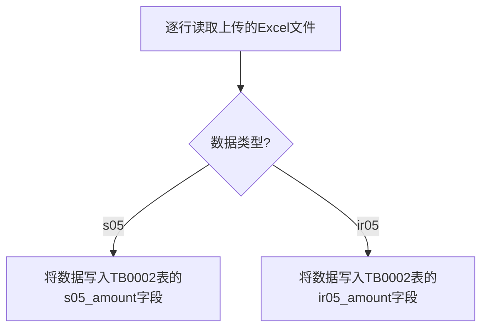
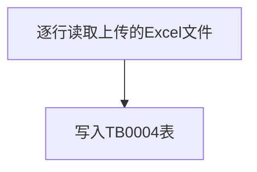
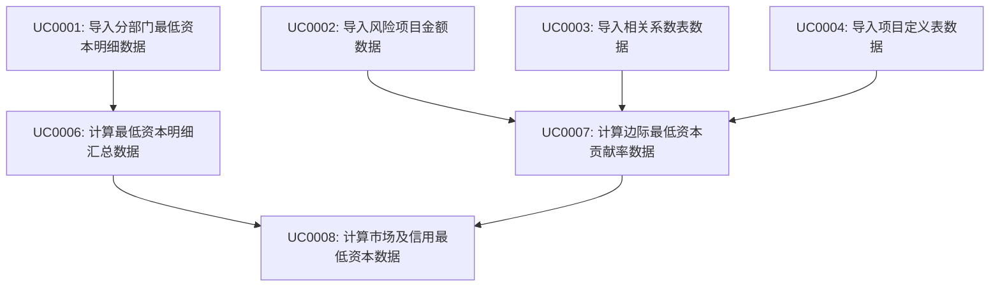
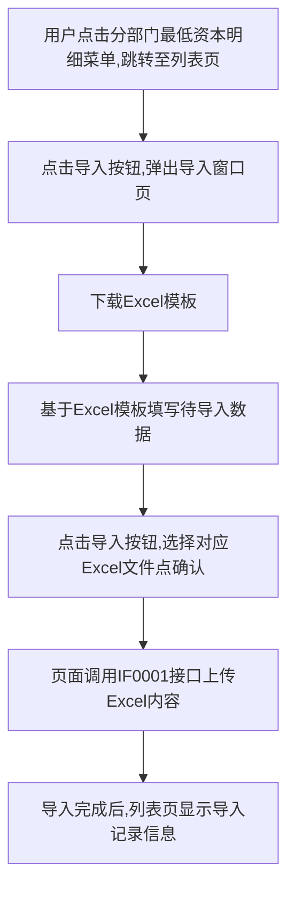

# 需求规格说明书模板

## 文档信息

| 项目名称 | 【需求名称】     |
| -------- |------------|
| 文档版本 | V1.0       |
| 作者     |            |
| 创建日期 | 2025-05-19 |
| 状态     | 已确认        |

## 变更履历

| 版本 | 日期       | 变更描述 | 修订人 | 审核 |
| ---- | ---------- | -------- | ------ | ---- |
| V1.0 | 2025-05-07 | 初次编写 |  | 通过 |

## 1. 需求概述

### 1.1 需求背景

先忽略

### 1.2 需求目标

先忽略

### 1.3 需求范围

先忽略

### 1.4 相关干系人

| 角色       | 部门 | 姓名 | 职责 |
| ---------- | ---- | ---- | ---- |
| 产品负责人 |      |      |      |
| 业务负责人 |      |      |      |
| 技术负责人 |      |      |      |

## 2. 业务架构

### 2.1 业务模块关系图

无

### 2.2 模块列表

| 模块编号 | 模块名称 | 模块英文名 | 英文缩写 |
| -------- | -------- | ---------- | -------- |
| MD0001   | 最低资本  | minimum capital | minc  |

### 2.3 数据模型

#### 2.3.1 最低资本模块
##### 2.3.1.1 表间关系
```mermaid
erDiagram
    %% 基础表
    TB0001["TB0001: 分部门最低资本明细表"]
    TB0002["TB0002: 风险项目金额表"]
    TB0004["TB0004: 相关系数表"]
    TB0005["TB0005: 项目定义表"]

    %% 计算表
    TB0006["TB0006: 边际最低资本贡献率表"]
    TB0007["TB0007: 最低资本明细汇总表"]
    TB0008["TB0008: 市场及信用最低资本表"]

    %% 数据流向
    TB0001 --> TB0007 : "汇总"
    TB0002 --> TB0006 : "计算"
    TB0004 --> TB0006 : "计算"
    TB0005 --> TB0006 : "计算"
    TB0006 --> TB0008 : "计算"
    TB0007 --> TB0008 : "计算"
```

##### 2.3.1.2 表名字典
| 表编号 | 表中文名 | 表英文名 | 备注 |
| ---- | ------ | ---- | ------ |
| TB0001 | 分部门最低资本明细表 | t_minc_dept_mincap_detail | 存储分部门最低资本明细数据 |
| TB0002 | 风险项目金额表 | t_minc_risk_item_amount | 存储S05-最低资本表和IR05-寿险业务保险风险的数据 |
| TB0004 | 相关系数表 | t_minc_correlation_coef | 存储风险项目间的相关系数数据 |
| TB0005 | 项目定义表 | t_minc_item_definition | 存储项目的定义和计算公式等配置信息 |
| TB0006 | 边际最低资本贡献率表 | t_minc_marginal_capital | 存储边际最低资本贡献率数据 |
| TB0007 | 最低资本明细汇总表 | t_minc_min_capital_summary | 存储最低资本明细汇总数据 |
| TB0008 | 市场及信用最低资本表 | t_minc_min_capital_by_account | 存储按账户类型汇总的市场及信用风险最低资本数据 |

##### 2.3.1.3 表集

##### （1）TB0001 分部门最低资本明细表 (t_minc_dept_mincap_detail)

| 字段名 | 数据类型 | 长度 | 允许空 | 唯一索引 | 默认值 | 说明 |
| ------ | ------- | ---- | ----- | ------- | ----- | ---- |
| **accounting_period** | varchar | 6 | 否 | 是 | - | 账期，格式：YYYYMM（如202306） |
| **department** | varchar | 100 | 否 | 是 | - | 统计部门名称 |
| **item_code** | varchar | 20 | 否 | 是 | - | 项目编码，关联项目定义表(t_minc_item_definition)的item_code |
| **account_code** | varchar | 10 | 否 | 是 | - | 账户编码，对应sys_dict_data表中dict_type='minc_account'的字典项 |
| amount | decimal | 18,10 | 是 | 否 | 0 | 账户金额 |

> 注：项目编码关联项目定义表(t_minc_item_definition)，账户编码使用RuoYi框架的sys_dict_data表进行管理
>
> 账户字典配置：
> - dict_type: minc_account
> - dict_label: 账户名称，如"传统账户"
> - dict_value: 账户编码，如"AC001"
> - remark: 可存储账户类型


##### （2）TB0002 风险项目金额表 (t_minc_risk_item_amount)

| 字段名 | 数据类型 | 长度 | 允许空 | 唯一索引 | 默认值 | 说明 |
| ------ | ------- | ---- | ----- | ------- | ----- | ---- |
| **accounting_period** | varchar | 6 | 否 | 是 | - | 账期，格式：YYYYMM（如202306） |
| **item_code** | varchar | 20 | 否 | 是 | - | 项目编码，对应sys_dict_data表中dict_type='minc_risk_item'的字典项 |
| s05_amount | decimal | 18,10 | 是 | 否 | 0 | S05-最低资本表的期末金额 |
| ir05_amount | decimal | 18,10 | 是 | 否 | 0 | IR05-寿险业务保险风险表的期末金额 |

> 注：TB0002中的项目编码使用RuoYi框架的sys_dict_data表进行管理，与项目定义表(TB0005)中的项目有部分重合。对于重合的部分，item_code需要保持一致，以便在计算时能够正确关联。
>
> 风险项目字典配置：
> - dict_type: minc_risk_item
> - dict_label: 项目名称，如"市场风险-利率风险最低资本"
> - dict_value: 项目编码，如"MR001"
> - remark: 可存储项目类型

##### （4）TB0004 相关系数表 (t_minc_correlation_coef)

| 字段名 | 数据类型 | 长度 | 允许空 | 唯一索引 | 默认值 | 说明 |
| ------ | ------- | ---- | ----- | ------- | ----- | ---- |
| **accounting_period** | varchar | 6 | 否 | 是 | - | 账期，格式：YYYYMM（如202306） |
| **item_code_x** | varchar | 20 | 否 | 是 | - | 第一个风险项目编码，关联项目定义表(t_minc_item_definition)的item_code |
| **item_code_y** | varchar | 20 | 否 | 是 | - | 第二个风险项目编码，关联项目定义表(t_minc_item_definition)的item_code |
| correlation_value | decimal | 5,2 | 否 | 否 | - | 存储相关系数，范围[-1,1] |

##### （5）TB0005 项目定义表 (t_minc_item_definition)

| 字段名 | 数据类型 | 长度 | 允许空 | 唯一索引 | 默认值 | 说明 |
| ------ | ------- | ---- | ----- | ------- | ----- | ---- |
| **item_code** | varchar | 20 | 否 | 是 | - | 项目编码，如：MR001 |
| item_name | varchar | 100 | 否 | 否 | - | 项目名称，如：市场风险-利率风险最低资本 |
| risk_type | varchar | 50 | 是 | 否 | - | 风险类型，如：市场风险、信用风险 |
| capital_item | varchar | 100 | 是 | 否 | - | 边际最低资本贡献率表中的项目名称，如：寿险业务保险风险最低资本合计 |
| correlation_item | varchar | 50 | 是 | 否 | - | 相关系数表中的项目名称，如：寿险 |
| parent_item_code | varchar | 20 | 是 | 否 | - | 指定该项目对应的上层级项目编码 |
| sub_risk_factor_formula | varchar | 500 | 是 | 否 | - | 子风险最低资本因子计算公式 |
| company_factor_formula | varchar | 500 | 是 | 否 | - | 公司整体最低资本因子计算公式 |
| capital_calculation_formula | varchar | 500 | 是 | 否 | - | 最低资本计算公式 |
| status | char | 1 | 否 | 否 | 1 | 状态：1-有效，0-无效 |

> 注：项目定义表是配置表，不需要账期字段。该表直接存储项目编码和名称的映射关系，不依赖于RuoYi的字典表。

##### （6）TB0006 边际最低资本贡献率表 (t_minc_marginal_capital)

| 字段名 | 数据类型 | 长度 | 允许空 | 唯一索引 | 默认值 | 说明 |
| ------ | ------- | ---- | ----- | ------- | ----- | ---- |
| **accounting_period** | varchar | 6 | 否 | 是 | - | 账期，格式：YYYYMM（如202306） |
| **item_code** | varchar | 20 | 否 | 是 | - | 项目编码，关联项目定义表(t_minc_item_definition)的item_code |
| reinsu_after_amount | decimal | 18,2 | 否 | 否 | 0 | 再保后金额，数值类型，保留2位小数 |
| sub_risk_marginal_factor | decimal | 10,4 | 是 | 否 | 0 | 存储子风险层面边际最低资本贡献因子，百分比格式，如：0.583表示58.3% |
| company_marginal_factor | decimal | 10,4 | 是 | 否 | 0 | 存储公司层面边际最低资本贡献因子，百分比格式，如：0.583表示58.3% |

##### （7）TB0007 最低资本明细汇总表 (t_minc_min_capital_summary)

| 字段名 | 数据类型 | 长度 | 允许空 | 唯一索引 | 默认值 | 说明 |
| ------ | ------- | ---- | ----- | ------- | ----- | ---- |
| **accounting_period** | varchar | 6 | 否 | 是 | - | 账期，格式：YYYYMM（如202306） |
| **item_code** | varchar | 20 | 否 | 是 | - | 项目编码，关联项目定义表(t_minc_item_definition)的item_code |
| **account_code** | varchar | 10 | 否 | 是 | - | 账户编码，对应sys_dict_data表中dict_type='minc_account'的字典项 |
| amount | decimal | 18,10 | 是 | 否 | 0 | 账户金额 |

> 注：表结构与TB0001分部门最低资本明细表保持一致，但不包含department字段，因为这是汇总后的数据

##### （8）TB0008 市场及信用最低资本表 (t_minc_min_capital_by_account)

| 字段名 | 数据类型 | 长度 | 允许空 | 唯一索引 | 默认值 | 说明 |
| ------ | ------- | ---- | ----- | ------- | ----- | ---- |
| **accounting_period** | varchar | 6 | 否 | 是 | - | 账期，格式：YYYYMM（如202306） |
| **item_code** | varchar | 20 | 否 | 是 | - | 项目编码，关联项目定义表(t_minc_item_definition)的item_code |
| **account_code** | varchar | 10 | 否 | 是 | - | 账户编码，对应sys_dict_data表中dict_type='minc_account'的字典项 |
| amount | decimal | 18,10 | 是 | 否 | 0 | 账户金额 |

> 注：表结构与TB0001和TB0007保持一致的设计风格，风险类型可以通过项目编码关联项目定义表(t_minc_item_definition)获取

### 2.4 用例列表

| 用例编号   | 用例名称             | 用例描述 | 模块编号 |
|--------|------------------| - | ---- |
| UC0001 | 导入分部门最低资本明细数据 | 导入分部门最低资本明细数据，写入t_minc_dept_mincap_detail表 | MD0001 |
| UC0002 | 导入风险项目金额数据 | 导入S05-最低资本表和IR05-寿险业务保险风险数据，写入t_minc_risk_item_amount表 | MD0001 |
| UC0003 | 导入相关系数表数据 | 导入相关系数表数据，写入t_minc_correlation_coef表 | MD0001 |
| UC0004 | 导入项目定义表数据 | 导入项目定义表数据，写入t_minc_item_definition表 | MD0001 |
| UC0006 | 计算最低资本明细汇总数据 | 根据分部门最低资本明细表数据计算汇总结果，写入t_minc_min_capital_summary表 | MD0001 |
| UC0007 | 计算边际最低资本贡献率数据 | 根据风险项目金额表、相关系数表和项目定义表计算边际最低资本贡献率，写入t_minc_marginal_capital表 | MD0001 |
| UC0008 | 计算市场及信用最低资本数据 | 根据边际最低资本贡献率表和最低资本明细汇总表计算市场及信用最低资本，写入t_minc_min_capital_by_account表 | MD0001 |

### 2.5 接口清单

| 接口编号   | 接口名称        | 接口描述 | 模块编号 |
| ------ |-------------| ---- | ---- |
| IF0001 | 导入分部门最低资本明细数据 | 导入分部门最低资本明细数据，写入t_minc_dept_mincap_detail表 | MD0001 |
| IF0002 | 导入风险项目金额数据 | 导入S05-最低资本表和IR05-寿险业务保险风险数据，写入t_minc_risk_item_amount表 | MD0001 |
| IF0003 | 导入相关系数表数据 | 导入相关系数表数据，写入t_minc_correlation_coef表 | MD0001 |
| IF0004 | 导入项目定义表数据 | 导入项目定义表数据，写入t_minc_item_definition表 | MD0001 |

## 3. 业务概念与术语

| 术语      | 定义   | 业务含义   | 备注   |
| ------- | ---- | ------ | ---- |
| 最低资本 | 保险公司为应对风险而必须持有的最低资本金额 | 根据监管要求，保险公司必须持有足够的资本以覆盖各类风险 | 包括市场风险、信用风险、保险风险等 |
| 边际最低资本贡献率 | 各风险项目对总体最低资本的边际贡献比例 | 用于衡量各风险项目对总体最低资本的影响程度 | 分为子风险层面和公司层面两种 |
| 相关系数 | 不同风险项目之间的相关性程度 | 用于计算风险分散效应，取值范围为[-1,1] | 1表示完全正相关，-1表示完全负相关，0表示不相关 |

## 4. 功能需求

### 4.1 最低资本模块

#### 4.1.1 原型图

忽略

#### 4.1.2 接口功能
##### 4.1.2.1 导入分部门最低资本明细数据(IF0001)
##### 4.1.2.1.1 接口功能概述

导入分部门最低资本明细数据

##### 4.1.2.1.2 接口基本信息
| 类型 | 描述 |
|--------|------|
| Method | POST |
| Content-Type | multipart/form-data |
| Url | https://alm.hongkang-life.com/api/minc/importDeptMincapDetail |

##### 4.1.2.1.3 接口入参
| 参数名 | 类型 | 是否必填 | 描述 |
|--------|------|----------|------|
| file | File | 是 | Excel文件 |

##### 4.1.2.1.4 接口出参
| 参数名 | 类型 | 描述 |
|--------|------|------|
| code | Long | 代码为200为成功,反则异常 |
| msg | String | 异常描述 |

成功示例:
```json
{
	"code": 200,
	"msg": ""
}
```

失败示例:
```json
{
	"code": 500,
	"msg": "系统异常,请联系管理员!"
}
```

##### 4.1.2.1.5 接口功能详述


##### 4.1.2.2 导入风险项目金额数据(IF0002)
##### 4.1.2.2.1 接口功能概述

导入S05-最低资本表和IR05-寿险业务保险风险数据

##### 4.1.2.2.2 接口基本信息
| 类型 | 描述 |
|--------|------|
| Method | POST |
| Content-Type | multipart/form-data |
| Url | https://alm.hongkang-life.com/api/minc/importRiskItemAmount |

##### 4.1.2.2.3 接口入参
| 参数名 | 类型 | 是否必填 | 描述 |
|--------|------|----------|------|
| file | File | 是 | Excel文件 |
| type | String | 是 | 数据类型，可选值：s05（最低资本表）、ir05（寿险业务保险风险） |

##### 4.1.2.2.4 接口出参
| 参数名 | 类型 | 描述 |
|--------|------|------|
| code | Long | 代码为200为成功,反则异常 |
| msg | String | 异常描述 |

成功示例:
```json
{
	"code": 200,
	"msg": ""
}
```

失败示例:
```json
{
	"code": 500,
	"msg": "系统异常,请联系管理员!"
}
```

##### 4.1.2.2.5 接口功能详述


##### 4.1.2.4 导入相关系数表数据(IF0003)
##### 4.1.2.4.1 接口功能概述

导入相关系数表数据

##### 4.1.2.4.2 接口基本信息
| 类型 | 描述 |
|--------|------|
| Method | POST |
| Content-Type | multipart/form-data |
| Url | https://alm.hongkang-life.com/api/minc/importCorrelationCoef |

##### 4.1.2.4.3 接口入参
| 参数名 | 类型 | 是否必填 | 描述 |
|--------|------|----------|------|
| file | File | 是 | Excel文件 |

##### 4.1.2.4.4 接口出参
| 参数名 | 类型 | 描述 |
|--------|------|------|
| code | Long | 代码为200为成功,反则异常 |
| msg | String | 异常描述 |

成功示例:
```json
{
	"code": 200,
	"msg": ""
}
```

失败示例:
```json
{
	"code": 500,
	"msg": "系统异常,请联系管理员!"
}
```

##### 4.1.2.4.5 接口功能详述


##### 4.1.2.5 导入项目定义表数据(IF0004)
##### 4.1.2.5.1 接口功能概述

导入项目定义表数据

##### 4.1.2.5.2 接口基本信息
| 类型 | 描述 |
|--------|------|
| Method | POST |
| Content-Type | multipart/form-data |
| Url | https://alm.hongkang-life.com/api/minc/importItemDefinition |

##### 4.1.2.5.3 接口入参
| 参数名 | 类型 | 是否必填 | 描述 |
|--------|------|----------|------|
| file | File | 是 | Excel文件 |

##### 4.1.2.5.4 接口出参
| 参数名 | 类型 | 描述 |
|--------|------|------|
| code | Long | 代码为200为成功,反则异常 |
| msg | String | 异常描述 |

成功示例:
```json
{
	"code": 200,
	"msg": ""
}
```

失败示例:
```json
{
	"code": 500,
	"msg": "系统异常,请联系管理员!"
}
```

##### 4.1.2.5.5 接口功能详述
```mermaid
flowchart TD
    A[逐行读取上传的Excel文件] --> B[写入TB0005表(t_minc_item_definition)]
```

#### 4.1.3 功能描述

##### 4.1.3.1 最低资本计算流程
###### 4.1.3.1.1 功能概要
通过3个主要步骤完成最低资本计算：数据导入、中间结果计算和最终结果计算。

###### 4.1.3.1.2 业务总流程


###### 4.1.3.1.3 用例描述
###### 4.1.3.1.3.1 导入分部门最低资本明细数据(UC0001)

|   用例标识   | 用例描述             |
| :----------: | ------------------ |
| 类型 | 服务 |
|   用例名称   | 导入分部门最低资本明细数据 |
|   功能描述   | 导入分部门最低资本明细数据 |
|    参与者    | 风险管理部人员 |
|    原型图    | PT0001 |
|    关联表    | TB0001 |
|    前置用例    | |


###### 4.1.3.1.3.2 计算最低资本明细汇总数据(UC0006)

|   用例标识   | 用例描述             |
| :----------: | ------------------ |
| 类型 | 批处理 |
|   用例名称   | 计算最低资本明细汇总数据 |
|   功能描述   | 根据分部门最低资本明细表数据计算汇总结果 |
|    参与者    | 系统 |
|    原型图    | |
|    关联表    | TB0001, TB0007 |
|    前置用例    | UC0001 |

**步骤1.** 数据准备

(1) 读取TB0001表、项目定义表和系统字典表数据:
   a. 读取TB0001表(分部门最低资本明细表)数据
   b. 读取TB0005表(项目定义表)数据，获取项目编码与项目名称的映射关系
   c. 读取sys_dict_data表中dict_type='minc_account'的数据，获取账户编码与账户名称的映射关系

**步骤2.** 汇总计算

(1) 使用项目定义表获取风险类型:
   a. 通过项目编码(item_code)关联项目定义表(t_minc_item_definition)，获取项目名称和风险类型
   b. 常见风险类型包括：市场风险、信用风险、保险风险等

(2) 汇总计算:
   a. 按账期、项目编码、账户编码分组
   b. 对每个分组，汇总amount值
   c. 将汇总结果作为新记录插入TB0007表，保持与TB0001表相同的结构（但不包含department字段）

**步骤3.** 数据入表

(1) 将汇总结果写入TB0007表

###### 4.1.3.1.3.3 计算边际最低资本贡献率数据(UC0007)

|   用例标识   | 用例描述             |
| :----------: | ------------------ |
| 类型 | 批处理 |
|   用例名称   | 计算边际最低资本贡献率数据 |
|   功能描述   | 计算边际最低资本贡献率 |
|    参与者    | 系统 |
|    原型图    | |
|    关联表    | TB0002, TB0004, TB0005, TB0006 |
|    前置用例    | UC0002, UC0003, UC0004 |

**步骤1.** 数据准备

(1) 读取TB0002表(风险项目金额表)数据：
   a. 使用s05_amount字段获取最低资本表数据
   b. 使用ir05_amount字段获取寿险业务保险风险数据
(2) 读取TB0004表(相关系数表)数据
(3) 读取TB0005表(项目定义表)数据，获取项目编码、项目名称和风险类型等信息
(4) 读取sys_dict_data表中dict_type='minc_risk_item'的数据，获取风险项目编码与项目名称的映射关系

**步骤2.** 计算边际最低资本贡献率

> 注意: 计算顺序非常重要，必须先计算子风险层面边际最低资本贡献因子，然后才能计算公司整体层面边际最低资本贡献因子。如果某个项目的子风险层面边际最低资本贡献因子为空，则无法计算其公司整体层面边际最低资本贡献因子。

(1) 建立项目之间的关系:
   a. 通过sys_dict_data表中dict_type='minc_risk_item'的字典项，获取风险项目金额表(TB0002)中项目的编码和名称
   b. 对于需要计算边际最低资本贡献率的项目，通过项目编码关联项目定义表(TB0005)
   c. 通过项目定义表(TB0005)的capital_item和correlation_item字段，识别S05-最低资本表和IR05-寿险业务保险风险表中的项目
   d. 通过项目定义表(TB0005)的risk_type字段，获取项目的风险类型信息

(2) 计算子风险层面边际最低资本贡献因子:
   a. 对于TB0002表中的每个项目:
      • 通过项目编码(item_code)查找sys_dict_data表中对应的项目名称
      • 检查该项目编码是否存在于项目定义表(TB0005)中
      • 如果存在，将该项目的s05_amount或ir05_amount值作为再保后金额(reinsu_after_amount)写入TB0006表

   b. 如果项目定义表中定义了sub_risk_factor_formula:
      • 使用该公式计算子风险层面边际最低资本贡献因子
      • 公式使用Aviator表达式引擎进行解析和计算，支持复杂的计算逻辑
      • 公式示例(以"寿险业务保险风险最低资本合计"为例，假设项目编码为"IR001"):
        ```
        (getAmount('IR001') * getCorrelation('IR001', 'IR001') +
         getAmount('IR002') * getCorrelation('IR001', 'IR002') +
         getAmount('MR001') * getCorrelation('IR001', 'MR001') +
         getAmount('CR001') * getCorrelation('IR001', 'CR001')) /
        (getAmount('IR001') + getAmount('IR002') + getAmount('MR001') + getAmount('CR001'))
        ```
      • 其中:
        - getAmount(itemCode): 获取指定项目编码的再保后金额
        - getCorrelation(itemCode1, itemCode2): 获取两个项目之间的相关系数
        - 项目编码规则:
          * IR001: 寿险业务保险风险最低资本合计
          * IR002: 非寿险业务保险风险最低资本合计
          * MR001: 市场风险-最低资本合计
          * CR001: 信用风险-最低资本合计
      • 系统会将公式中的函数替换为实际值，例如:
        - getAmount('IR001') → 1,808,553,609
        - getCorrelation('IR001', 'IR001') → 1
        - getAmount('IR002') → 52,116
        - getCorrelation('IR001', 'IR002') → 0.2
        - 等等
      • 最终计算结果为: (1,808,553,609*1 + 52,116*0.2 + 4,222,971,224*0.3 + 1,152,921,914*0.15) / (1,808,553,609 + 52,116 + 4,222,971,224 + 1,152,921,914) = 0.583

   c. 如果项目没有定义sub_risk_factor_formula:
      • 根据相关系数表(TB0004)和边际最低资本贡献率表(TB0006)中的数据计算
      • 计算步骤如下:
        1. 根据当前项目编码在相关系数表中查找所有与之相关的项目(item_code_x等于当前项目编码的记录)
        2. 获取这些相关项目(item_code_y)的相关系数(correlation_value)
        3. 在边际最低资本贡献率表中查找这些相关项目的再保后金额(reinsu_after_amount)
        4. 计算公式: (当前项目的再保后金额 * 1 + 相关项目1的再保后金额 * 相关系数1 + 相关项目2的再保后金额 * 相关系数2 + ...) / (当前项目的再保后金额 + 相关项目1的再保后金额 + 相关项目2的再保后金额 + ...)
        5. 例如，对于项目编码为"IR001"的"寿险业务保险风险最低资本合计"项目:
           - 在相关系数表中找到与"IR001"相关的项目及系数: IR001(1)、IR002(0.2)、MR001(0.3)、CR001(0.15)
           - 获取这些项目的再保后金额: IR001(1,808,553,609)、IR002(52,116)、MR001(4,222,971,224)、CR001(1,152,921,914)
           - 计算子风险层面边际最低资本贡献因子 = (1*1,808,553,609 + 0.2*52,116 + 0.3*4,222,971,224 + 0.15*1,152,921,914) / (1,808,553,609 + 52,116 + 4,222,971,224 + 1,152,921,914)

   d. 如果项目有父项目(parent_item_code)且无法通过上述方法计算:
      • 继承父项目的子风险层面边际最低资本贡献因子
      • 如果父项目也没有计算结果，则该项目的子风险层面边际最低资本贡献因子为空
      • 注意: 子风险层面边际最低资本贡献因子必须先计算出来，才能进行公司整体层面边际最低资本贡献因子的计算

   e. 如果项目不存在于项目定义表中:
      • 该项目不参与边际最低资本贡献率的计算

(3) 计算公司层面边际最低资本贡献因子:
   a. 根据项目的层级关系计算:
      • 一级风险项目: 公司层面边际最低资本贡献因子等于子风险层面边际最低资本贡献因子
        - 例如: "寿险业务保险风险最低资本合计"(IR001)的公司层面边际最低资本贡献因子 = 0.583，与其子风险层面边际最低资本贡献因子相同

      • 二级风险项目: 公司层面边际最低资本贡献因子 = 项目的子风险层面边际最低资本贡献因子 × 对应一级项目的子风险层面边际最低资本贡献因子
        - 例如: "寿险业务保险风险-损失发生风险最低资本"的公司层面边际最低资本贡献因子 = 0.3319 × 0.583 = 0.1935
        - 例如: "寿险业务保险风险-退保风险最低资本"的公司层面边际最低资本贡献因子 = 0.9428 × 0.583 = 0.5497
        - 例如: "市场风险-利率风险最低资本"的公司层面边际最低资本贡献因子 = 0.7153 × 0.9276 = 0.6635

      • 三级风险项目: 公司层面边际最低资本贡献因子 = 项目的子风险层面边际最低资本贡献因子 × 对应二级项目的子风险层面边际最低资本贡献因子 × 对应一级项目的子风险层面边际最低资本贡献因子
        - 例如: "损失发生风险最低资本-死亡发生率风险"的公司层面边际最低资本贡献因子 = 0.5409 × 0.3319 × 0.583 = 0.1047

      • 四级风险项目: 公司层面边际最低资本贡献因子 = 项目的子风险层面边际最低资本贡献因子 × 对应三级项目的子风险层面边际最低资本贡献因子 × 对应二级项目的子风险层面边际最低资本贡献因子 × 对应一级项目的子风险层面边际最低资本贡献因子
        - 例如: "损失发生风险最低资本-疾病风险-疾病发生率风险"的公司层面边际最低资本贡献因子 = 0.7138 × 0.9371 × 0.3319 × 0.583 = 0.1294

   b. 使用Aviator表达式引擎实现灵活配置:
      • 在项目定义表(TB0005)中的company_factor_formula字段配置计算公式
      • 公式示例(以二级风险项目"寿险业务保险风险-损失发生风险最低资本"为例，假设项目编码为"IR001_01"):
        ```
        getSubRiskFactor('IR001_01') * getSubRiskFactor('IR001')
        ```
      • 公式示例(以三级风险项目"损失发生风险最低资本-死亡发生率风险"为例，假设项目编码为"IR001_01_01"):
        ```
        getSubRiskFactor('IR001_01_01') * getSubRiskFactor('IR001_01') * getSubRiskFactor('IR001')
        ```
      • 其中:
        - getSubRiskFactor(itemCode): 获取指定项目编码的子风险层面边际最低资本贡献因子
      • 系统会根据项目的层级关系，自动查找上级项目，并计算公司层面边际最低资本贡献因子

   c. 如果项目没有定义company_factor_formula:
      • 系统会根据项目定义表(TB0005)中的parent_item_code字段，自动构建项目的层级关系
      • 然后按照上述计算规则，计算公司层面边际最低资本贡献因子

   d. 注意事项:
      • 只有当项目的子风险层面边际最低资本贡献因子已计算出来时，才能计算其公司层面边际最低资本贡献因子
      • 如果项目的任何上级项目的子风险层面边际最低资本贡献因子为空，则无法计算该项目的公司层面边际最低资本贡献因子
      • 计算顺序应该是从一级项目开始，逐级向下计算

**步骤3.** 数据入表

(1) 将计算结果写入TB0006表(边际最低资本贡献率表)

###### 4.1.3.1.3.4 计算市场及信用最低资本数据(UC0008)

|   用例标识   | 用例描述             |
| :----------: | ------------------ |
| 类型 | 批处理 |
|   用例名称   | 计算市场及信用最低资本数据 |
|   功能描述   | 计算市场及信用最低资本 |
|    参与者    | 系统 |
|    原型图    | |
|    关联表    | TB0006, TB0007, TB0008 |
|    前置用例    | UC0006, UC0007 |

**步骤1.** 数据准备

(1) 读取TB0006表(边际最低资本贡献率表)数据
(2) 读取TB0007表(最低资本明细汇总表)数据

**步骤2.** 计算市场及信用最低资本

(1) 计算各账户下的市场风险和信用风险最低资本:
   a. 对于TB0007表(最低资本明细汇总表)中的每条记录:
      • 通过项目编码(item_code)关联项目定义表(t_minc_item_definition)，获取风险类型
      • 筛选风险类型为"市场风险"或"信用风险"的记录
      • 通过项目编码(item_code)关联TB0006表(边际最低资本贡献率表)，获取对应的公司层面边际最低资本贡献因子(company_marginal_factor)
      • 计算最低资本金额 = TB0007表中的amount值 × TB0006表中的company_marginal_factor值

   b. 按风险类型、账户编码分组汇总:
      • 对于"市场风险"类型的记录，按账户编码分组汇总计算结果，得到各账户下的市场风险最低资本合计
      • 对于"信用风险"类型的记录，按账户编码分组汇总计算结果，得到各账户下的信用风险最低资本合计
      • 例如:
        - 传统账户下的市场风险最低资本合计 = 传统账户下所有市场风险项目的(amount × company_marginal_factor)之和
        - 传统账户下的信用风险最低资本合计 = 传统账户下所有信用风险项目的(amount × company_marginal_factor)之和
        - 分红账户下的市场风险最低资本合计 = 分红账户下所有市场风险项目的(amount × company_marginal_factor)之和
        - 以此类推...

   c. 计算普通账户:
      • 普通账户的市场风险最低资本 = 传统账户 + 分红账户 + 万能账户 + 独立账户的市场风险最低资本之和
      • 普通账户的信用风险最低资本 = 传统账户 + 分红账户 + 万能账户 + 独立账户的信用风险最低资本之和

(2) 使用项目定义表中的最低资本计算公式实现灵活配置:
   a. 在项目定义表(TB0005)中的capital_calculation_formula字段配置计算公式
   b. 公式示例(以"市场风险-最低资本合计"为例):
      ```
      sum(getAccountAmount('MR001_01', 'AC001') * getCompanyFactor('MR001_01'),
          getAccountAmount('MR001_02', 'AC001') * getCompanyFactor('MR001_02'),
          getAccountAmount('MR001_03', 'AC001') * getCompanyFactor('MR001_03'))
      ```
   c. 其中:
      • getAccountAmount(itemCode, accountCode): 获取指定项目编码和账户编码的金额
      • getCompanyFactor(itemCode): 获取指定项目编码的公司层面边际最低资本贡献因子
      • sum(): 计算参数的总和
   d. 系统会根据公式计算各账户下的市场风险和信用风险最低资本

**步骤3.** 数据入表

(1) 将计算结果写入TB0008表(市场及信用最低资本表)
