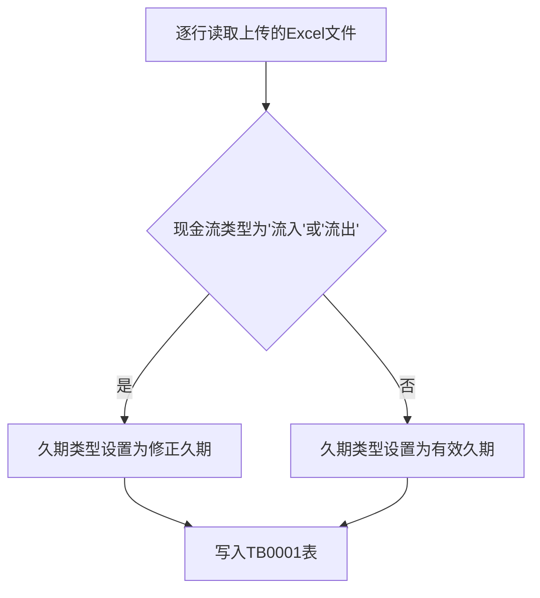
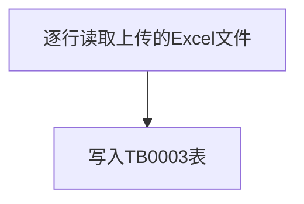
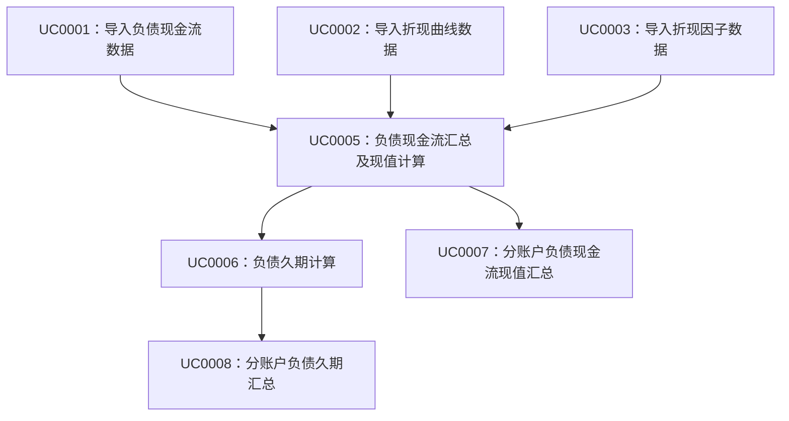
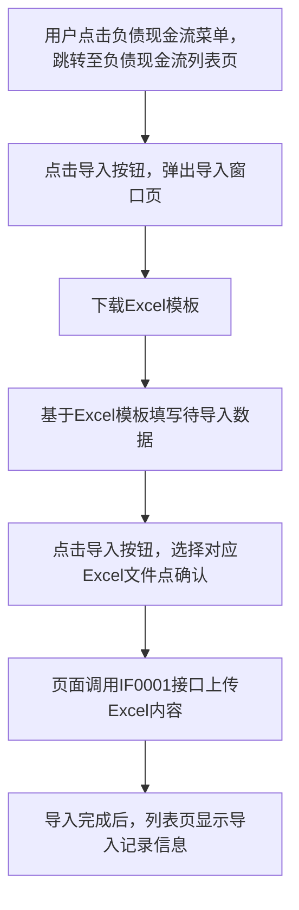
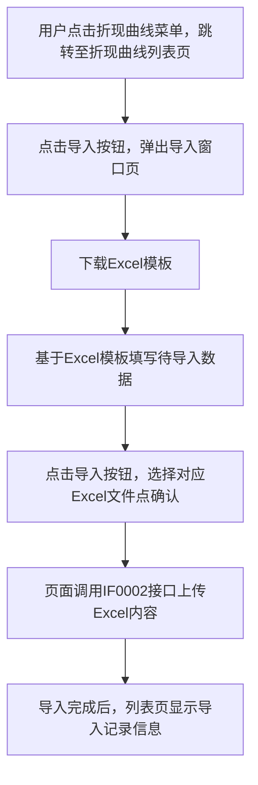
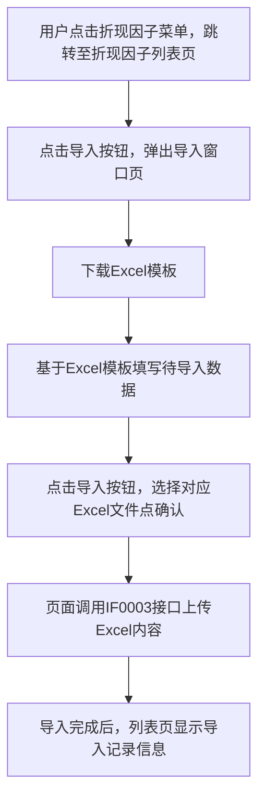

# 需求规格说明书模板

## 文档信息

| 项目名称 | 【需求名称】 |
| -------- | ------------ |
| 文档版本 | V1.0         |
| 作者     | 孔镇浩       |
| 创建日期 | 2025-04-10   |
| 状态     | 已确认       |

## 变更履历

| 版本 | 日期       | 变更描述 | 修订人 | 审核 |
| ---- | ---------- | -------- | ------ | ---- |
| V1.0 | 2025-04-10 | 初次编写 | 孔镇浩 | 通过 |

## 1. 需求概述

### 1.1 需求背景

先忽略

### 1.2 需求目标

先忽略

### 1.3 需求范围

先忽略

### 1.4 相关干系人

| 角色       | 部门 | 姓名 | 职责 |
| ---------- | ---- | ---- | ---- |
| 产品负责人 |      |      |      |
| 业务负责人 |      |      |      |
| 技术负责人 |      |      |      |

## 2. 业务架构

### 2.1 业务模块关系图

无

### 2.2 模块列表

| 模块编号 | 模块名称 | 模块英文名 | 英文缩写 |
| -------- | -------- | ---------- | -------- |
| MD0001   | 久期     | duration   | dur      |
| MD0002   | 负债     | liability  | liab     |

### 2.3 数据模型

#### 2.3.1 久期模块
##### 2.3.1.1 表间关系
```mermaid
erDiagram
折现曲线表
折现因子表
负债现金流表 }|--|| 负债现金流汇总表 : 汇总
负债现金流汇总表 ||--|| 负债久期汇总表 : 1v1
负债现金流汇总表 }|--|| 分账户负债现金流现值汇总表 : 汇总
负债久期汇总表 }|--|| 分账户负债久期汇总表 : 汇总


```
##### 2.3.1.2 表名字典
| 表编号 | 表中文名 | 表英文名 | 备注 |
| ---- | ------ | ---- | ------ |
| TB0001 | 负债现金流表 | t_dur_liability_cash_flow  |  |
| TB0002 | 折现曲线表 | t_dur_discount_curve  |  |
| TB0003 | 折现因子表 | t_dur_discount_factor  |  |
| TB0005 | 负债现金流汇总表 | t_dur_liability_cash_flow_summary  |  |
| TB0007 | 负债久期汇总表 | t_dur_liability_duration_summary  |  |
| TB0008 | 分账户负债现金流现值汇总表 | t_dur_sub_account_liability_present_value  |  |
| TB0009 | 分账户负债久期汇总表 | t_dur_sub_account_liability_duration  |  |

##### 2.3.1.3 表集
**（1）TB0001**

| 字段名              | 数据类型 | 长度  | 允许空 | 唯一索引 | 默认值 | 说明                                                         |
| ------------------- | -------- | ----- | ------ | -------- | ------ | ------------------------------------------------------------ |
| **account_period**  | varchar  | 6     | 否     | 是       | 无     | 账期，格式YYYYMM                                             |
| **cash_flow_type**  | char     | 2     | 否     | 是       | 无     | 现金流类型,01:流入,02:流出,03:流出+50bp,04:流出-50bp         |
| **duration_type**   | char     | 2     | 否     | 是       | 无     | 久期类型,01:修正久期,02:有效久期                             |
| **design_type**     | varchar  | 50    | 否     | 是       | 无     | 设计类型                                                     |
| **is_short_term**   | char     | 1     | 否     | 是       | 'N'    | 是否为中短期险种                                             |
| **actuarial_code**  | varchar  | 20    | 否     | 是       | 无     | 精算代码                                                     |
| business_code       | varchar  | 20    | 否     | 否       | 无     | 业务代码                                                     |
| product_name        | varchar  | 50    | 否     | 否       | 无     | 产品名称                                                     |
| insurance_main_type | varchar  | 50    | 否     | 否       | 无     | 险种主类                                                     |
| insurance_sub_type  | varchar  | 50    | 否     | 否       | 无     | 险种细类                                                     |
| cash_val_set        | varchar  | 65535 | 否     | 否       | 无     | 现金流值集,分为1272项,格式{"1":{"date":"2025-01-01","val":0.25},"2":{"date":"2025-01-02","val":0.35},...,"1272":{"date":"2025-12-01","val":0.15}} |

**（2）TB0002**

| 字段名             | 数据类型 | 长度  | 允许空 | 唯一索引 | 默认值 | 说明                                                         |
| ------------------ | -------- | ----- | ------ | -------- | ------ | ------------------------------------------------------------ |
| **account_period** | varchar  | 6     | 否     | 是       | 无     | 账期，格式YYYYMM                                             |
| **curve_type**     | char     | 2     | 否     | 是       | 无     | 曲线类型,01:中档,02:低档                                     |
| **duration_type**  | char     | 2     | 否     | 是       | 无     | 久期类型,01:修正久期,02:有效久期                             |
| curve_val_set      | varchar  | 65535 | 否     | 否       | 无     | 曲线值集,分为1272项,格式{"1":{"date":"2025-01-01","val":0.25},"2":{"date":"2025-01-02","val":0.35},...,"1272":{"date":"2025-12-01","val":0.15}} |

**（3）TB0003**

| 字段名                | 数据类型 | 长度 | 允许空 | 唯一索引 | 默认值            | 说明                     |
| --------------------- | -------- | ---- | ------ | ---- | ----------------- | ------------------------ |
| **account_period**    | varchar  | 6    | 否     | 是  | 无                | 账期，格式YYYYMM         |
| **factor_type**     | char  | 2  | 否     | 是  | 无                | 因子类型,01:中档,02:低档 |
| **duration_type** | char | 2 | 否 | 是 | 无 | 久期类型,01:修正久期,02:有效久期 |
| factor_val_set | varchar | 65535 | 否     | 否   | 无                | 因子值集,分为1272项,格式{"1":{"date":"2025-01-01","val":0.25},"2":{"date":"2025-01-02","val":0.35},...,"1272":{"date":"2025-12-01","val":0.15}} |

**（3）TB0005**

| 字段名          | 数据类型 | 长度 | 允许空 | 唯一索引 | 默认值            | 说明                     |
| --------------- | -------- | ---- | ------ | ---- | ----------------- | ------------------------ |
| **account_period** | varchar  | 6    | 否     | 是  | 无                | 账期，格式YYYYMM         |
| **cash_flow_type** | char     | 2     | 否     | 是       | 无     | 现金流类型,01:流入,02:流出,03:流出+50bp,04:流出-50bp         |
| **duration_type**  | char     | 2     | 否     | 是       | 无     | 久期类型,01:修正久期,02:有效久期                             |
| **design_type** | varchar  | 50   | 否     | 是 | 无                | 设计类型                 |
| **is_short_term**  | char     | 1     | 否     | 是      | 'N'    | 是否为中短期险种                                             |
| cash_val_set       | varchar  | 65535 | 否     | 否       | 无     | 现金流值集,分为1272项,格式{"1":{"date":"2025-01-01","val":0.25},"2":{"date":"2025-01-02","val":0.35},...,"1272":{"date":"2025-12-01","val":0.15}} |
| present_cash_val_set | varchar | 65535 | 否 | 否 | 无 | 现金流现值值集,分为1272项,格式{"1":{"date":"2025-01-01","val":0.25},"2":{"date":"2025-01-02","val":0.35},...,"1272":{"date":"2025-12-01","val":0.15}} |

**（4）TB0007**

| 字段名          | 数据类型 | 长度 | 允许空 | 唯一索引 | 默认值            | 说明                     |
| --------------- | -------- | ---- | ------ | ---- | ----------------- | ------------------------ |
| **account_period** | varchar  | 6    | 否     | 是 | 无                | 账期，格式YYYYMM         |
| **cash_flow_type** | char     | 2     | 否     | 是       | 无     | 现金流类型,01:流入,02:流出,03:流出+50bp,04:流出-50bp         |
| **duration_type**  | char     | 2     | 否     | 是       | 无     | 久期类型,01:修正久期,02:有效久期                             |
| **design_type** | varchar  | 50   | 否     | 是  | 无                | 设计类型                 |
| **is_short_term**  | char     | 1     | 否     | 是      | 'N'    | 是否为中短期险种                                             |
| duration_val_set   | varchar  | 65535 | 否     | 否       | 无     | 久期值集,分为1272项,格式{"1":{"date":"2025-01-01","val":0.25},"2":{"date":"2025-01-02","val":0.35},...,"1272":{"date":"2025-12-01","val":0.15}} |

**（5）TB0008**

| 字段名          | 数据类型 | 长度 | 允许空 | 唯一索引 | 默认值            | 说明                     |
| --------------- | -------- | ---- | ------ | ---- | ----------------- | ------------------------ |
| **account_period** | varchar  | 6    | 否     | 是  | 无                | 账期，格式YYYYMM         |
| **cash_flow_type** | char     | 2     | 否     | 是       | 无     | 现金流类型,01:流入,02:流出,03:流出+50bp,04:流出-50bp         |
| **duration_type**  | char     | 2     | 否     | 是       | 无     | 久期类型,01:修正久期,02:有效久期                             |
| **design_type** | varchar  | 50   | 否     | 是  | 无                | 设计类型                 |
| present_cash_val_set | varchar  | 65535 | 否     | 否       | 无     | 现金流现值值集,分为1272项,格式{"1":{"date":"2025-01-01","val":0.25},"2":{"date":"2025-01-02","val":0.35},...,"1272":{"date":"2025-12-01","val":0.15}} |

**（6）TB0009**

| 字段名          | 数据类型 | 长度 | 允许空 | 唯一索引 | 默认值            | 说明                     |
| --------------- | -------- | ---- | ------ | ---- | ----------------- | ------------------------ |
| **account_period** | varchar  | 6    | 否     | 是  | 无                | 账期，格式YYYYMM         |
| **cash_flow_type** | char     | 2     | 否     | 是       | 无     | 现金流类型,01:流入,02:流出,03:流出+50bp,04:流出-50bp         |
| **duration_type**  | char     | 2     | 否     | 是       | 无     | 久期类型,01:修正久期,02:有效久期                             |
| **design_type** | varchar  | 50   | 否     | 是  | 无                | 设计类型                 |
| duration_val_set   | varchar  | 65535 | 否     | 否       | 无     | 久期值集,分为1272项,格式{"1":{"date":"2025-01-01","val":0.25},"2":{"date":"2025-01-02","val":0.35},...,"1272":{"date":"2025-12-01","val":0.15}} |

### 2.4 用例列表

| 用例编号   | 用例名称 | 用例描述 | 模块编号 |
| ------ | ---- | ---- | ---- |
| UC0001 | 久期计算 | XXX | MD0001 |
| UC0002 | 订单模块 | YYY | MD0001 |

### 2.5 接口清单
| 接口编号   | 接口名称 | 接口描述 | 模块编号 |
| ------ | ---- | ---- | ---- |
| IF0001 | 查询XXX | XXX | MD0001 |
| IF0002 | 查询YYY | YYY | MD0001 |

## 3. 业务概念与术语

| 术语      | 定义   | 业务含义   | 备注   |
| ------- | ---- | ------ | ---- |
| 【通用术语1】 | 【定义】 | 【业务含义】 | 【备注】 |
| 【通用术语2】 | 【定义】 | 【业务含义】 | 【备注】 |

## 4. 功能需求

### 4.1 久期模块

#### 4.1.1 原型图

#### 4.1.1.1 负债现金流列表页

##### 4.1.1.1.1 原型图


##### 4.1.1.1.2 查询条件
| 字段名 | 字段类型 | 格式 | 备注 |
| ------ | -------- | ------ | ---- |
| 账期 | 输入框 | 长度20 | 日期选择器，格式为YYYYMM |
| 现金流类型 | 下拉框 | 长度20 | 可选值未显示 |
| 精算代码 | 输入框 | 长度20 | 无 |
| 业务代码 | 输入框 | 长度20 | 无 |
| 久期类型 | 下拉框 | 长度20 | 可选值未显示 |
| 险种主类 | 下拉框 | 长度20 | 可选值未显示 |
| 设计类型 | 下拉框 | 长度20 | 可选值未显示 |
| 险种细类 | 下拉框 | 长度20 | 可选值未显示 |


##### 4.1.1.1.3 列表展示
| 字段名 | 字段类型 | 格式 | 备注 |
| ------ | -------- | ------ | ---- |
| 账期 | 文本 | 长度6 | 表格列,显示格式YYYYMM |
| 现金流类型 | 文本 | 长度20 | 表格列，显示现金流类别 |
| 精算代码 | 文本 | 长度20 | 表格列，显示代码，如AC001 |
| 业务代码 | 文本 | 长度20 | 表格列，显示代码，如BC001 |
| 日期 | 日期 | 长度10 | 表格列，格式为YYYY-MM-DD |
| 久期类型 | 文本 | 长度20 | 表格列，显示久期分类，如"中期" |
| 1 | 数值 | 长度20 | 表格列，显示金额，有千位分隔符 |
| 2          | 数值       | 长度20 | 表格列，显示金额，有千位分隔符 |
| ...        | ...        | ...    | ... |
| 1272       | 数值       | 长度20 | 表格列，显示金额，有千位分隔符 |
| 操作 | 操作按钮组 | - | 包含编辑、删除按钮 |
##### 4.1.1.1.4 其他描述

#### 4.1.1.2 折现因子列表页（PT0002）

##### 4.1.1.2.1 原型图


##### 4.1.1.2.2 查询条件

| 字段名   | 字段类型 | 格式  | 备注       |
| -------- | -------- | ----- | ---------- |
| 账期     | 输入框   | 长度6 | 格式YYYYMM |
| 因子类型 | 下拉框   | 长度2 |            |
| 久期类型 | 下拉框   | 长度2 |            |

##### 4.1.1.2.3 列表展示

| 字段名   | 格式       | 备注               |
| -------- | ---------- | ------------------ |
| 账期名称 | 文本       | 长度6无            |
| 因子类型 | 文本       | 长度2              |
| 久期类型 | 文本       | 长度2              |
| 1        | 数值       | 长度20             |
| 2        | 数值       | 长度20             |
| ...      | ...        | ...                |
| 1272     | 数值       | 长度20             |
| 操作     | 操作按钮组 | 包含编辑、删除按钮 |

##### 4.1.1.2.4 其他描述

#### 4.1.1.3 折现曲线列表页（PT0003）

##### 4.1.1.3.1 原型图


##### 4.1.1.3.2 查询条件

| 字段名   | 字段类型 | 格式  | 备注       |
| -------- | -------- | ----- | ---------- |
| 账期     | 输入框   | 长度6 | 格式YYYYMM |
| 曲线类型 | 下拉框   | 长度2 |            |
| 久期类型 | 下拉框   | 长度2 |            |

##### 4.1.1.3.3 列表展示

| 字段名   | 格式       | 备注               |
| -------- | ---------- | ------------------ |
| 账期名称 | 文本       | 长度6无            |
| 曲线类型 | 文本       | 长度2              |
| 久期类型 | 文本       | 长度2              |
| 1        | 数值       | 长度20             |
| 2        | 数值       | 长度20             |
| ...      | ...        | ...                |
| 1272     | 数值       | 长度20             |
| 操作     | 操作按钮组 | 包含编辑、删除按钮 |

##### 4.1.1.3.4 其他描述

#### 4.1.2 接口功能
##### 4.1.2.1 导入负债现金流数据(FN0001)
##### 4.1.2.1.1 接口功能概述

导入负债现金流数据

##### 4.1.2.1.2 接口基本信息
| 类型 | 描述 |
|--------|------|
| Method | POST |
| Content-Type | multipart/form-data |
| Url | https://alm.hongkang-life.com/api/dur/importLiabilibyCashFlow |

##### 4.1.2.1.3 接口入参
| 参数名 | 类型 | 是否必填 | 描述 |
|--------|------|----------|------|
| file | File | 是 |  |
##### 4.1.2.1.4 接口出参

| 参数名 | 类型 | 描述 |
|--------|------|------|
| code | Long | 代码为200为成功,反则异常 |
| msg | String | 异常描述 |
成功示例:
```json
{
	"code": 200,
	"msg": ""
}
```
失败示例:
```json
{
	"code": 500,
	"msg": "系统异常,请联系管理员!"
}
```
##### 4.1.2.1.5 接口功能详述


##### 4.1.2.2 导入折现曲线数据(IF0002)
##### 4.1.2.2.1 接口功能概述

导入折现曲线数据

##### 4.1.2.2.2 接口基本信息
| 类型 | 描述 |
|--------|------|
| Method | POST |
| Content-Type | multipart/form-data |
| Url | https://alm.hongkang-life.com/api/dur/importDiscountCurve |

##### 4.1.2.2.3 接口入参
| 参数名 | 类型 | 是否必填 | 描述 |
|--------|------|----------|------|
| file | File | 是 |  |
##### 4.1.2.2.4 接口出参
| 参数名 | 类型 | 描述 |
|--------|------|------|
| code | Long | 代码为200为成功,反则异常 |
| msg | String | 异常描述 |
成功示例:
```json
{
	"code": 200,
	"msg": ""
}
```
失败示例:
```json
{
	"code": 500,
	"msg": "系统异常,请联系管理员!"
}
```
##### 4.1.2.2.5 接口功能详述

##### 4.1.2.3 导入折现因子数据(IF0003)
##### 4.1.2.3.1 接口功能概述

导入折现因子数据

##### 4.1.2.3.2 接口基本信息
| 类型 | 描述 |
|--------|------|
| Method | POST |
| Content-Type | multipart/form-data |
| Url | https://alm.hongkang-life.com/api/dur/importDiscountFactor |

##### 4.1.2.3.3 接口入参
| 参数名 | 类型 | 是否必填 | 描述 |
|--------|------|----------|------|
| file | File | 是 |  |
##### 4.1.2.3.4 接口出参
| 参数名 | 类型 | 描述 |
|--------|------|------|
| code | Long | 代码为200为成功,反则异常 |
| msg | String | 异常描述 |
成功示例:
```json
{
	"code": 200,
	"msg": ""
}
```
失败示例:
```json
{
	"code": 500,
	"msg": "系统异常,请联系管理员!"
}
```
##### 4.1.2.3.5 接口功能详述

#### 4.1.3 功能描述

##### 4.1.3.1 分账户现金流及久期计算功能（FN0001）

##### 4.1.3.1.1 功能概要

通过5步完成分账户现金流及久期计算
##### 4.1.3.1.2 业务总流程


##### 4.1.3.1.3 用例描述
##### 4.1.3.1.3.1 导入负债现金流数据(UC0001)

|   用例标识   | 用例描述             |
| :----------: | ------------------ |
| 类型 | 服务 |
|   用例名称   | 导入负债现金流数据                     |
|   功能描述   | 导入负债现金流数据 |
|    参与者    | 资产管理部人员     |
|    原型图    | PT0001             |
|    关联表    | TB0001             |
|    前置用例    | |

##### 4.1.3.1.3.2 导入折现曲线数据(UC0002)
|   用例标识   | 用例描述             |
| :----------: | ------------------------------------ |
| 类型 | 服务 |
|   用例名称   | 导入折现曲线数据                     |
|   功能描述   | 导入折现曲线数据 |
|    参与者    | 资产管理部人员                       |
|    原型图    | PT0002                               |
|    关联表    | TB0002                               |
|    前置用例    | |

##### 4.1.3.1.3.3 导入折现因子数据(UC0003)
|   用例标识   | 用例描述             |
| :----------: | ------------------------------------ |
| 类型 | 服务 |
|   用例名称   | 导入折现因子数据                     |
|   功能描述   | 导入折现因子数据 |
|    参与者    | 资产管理部人员                       |
|    原型图    | PT0003                               |
|    关联表    | TB0003                               |
|    前置用例    | |

##### 4.1.3.1.3.4 负债现金流汇总及现值计算(UC0005)
|   用例标识   | 用例描述             |
| :----------: | ------------------------------------ |
| 类型 | 批处理 |
|   用例名称   | 负债现金流汇总及现值计算                |
|   功能描述   | 负债现金流汇总及现值计算 |
|    参与者    | 系统                     |
|    原型图    |                                |
|    关联表    | TB0001,TB0003,TB0005                        |
|    前置用例    | UC0001,UC0002,UC0003                       |

**步骤1.** 加载因子表

(1) 读取TB0003表,用|拼接account_period,factor_type,duration_type作为key,factor_val_set作为value构建因子HashMap,以便后面快速读取

**步骤2.** 现金流汇总

(1) 遍历TB0001表读取现金流记录,用|拼接account_period,cash_flow_type,duration_type,design_type,is_short_term作为key,cash_val_set作为value构建现金流HashMap. value数据格式为{"1":{"date":"2025-01-01","val":0.25},"2":{"date":"2025-01-02","val":0.35},...,"1272":{"date":"2025-12-01","val":0.15}},这里"1","2","1272"为序号.

(2) key相同的记录,遍历value中所有数据,按对应序号累加到HashMap value对应序号的数据值上

(3) 所有记录遍历完成后,HashMap中就有了汇总的现金流value,下一步进行现金流现值计算

**步骤3.** 计算现金流现值

(1) 遍历现金流HashMap记录,逐条记录执行以下操作

定义:

cash[i]代表HashMap中value的第i个序号对应的val值

fac[j]是因子HashMap中value的第j个序号对应的值,提取现金流HashMap的key的account_period,cash_flow_type,duration_type信息,其中cash_flow_type转为factor_type查询因子HashMap并找到对应的value信息,factor_type设置值的逻辑如下:

- design_type为"传统险","分红险","万能险"同时is_short_term为Y时factor_type为02
- design_type为"万能险"同时is_short_term为N时factor_type为02
- 其他情况factor_type为01

present_value[i]是通过cash和fac向量计算出来的现金流现值第i个序号对应的值:

a. **present_value[1]**

- `A` 的子向量：全部元素 `[cash1, cash2, ..., cash1272]`
- `B^T` 的子向量：全部元素 `[fac1, fac2, ..., fac1272]`
- 公式：present_value[1]=∑[*j*=1,1272]cash*[j]*×fac[*j*]

b. **present_value[2]**

- `A` 的子向量：从第 2 个元素开始到末尾 `[cash2, cash3, ..., cash1272]`
- `B^T` 的子向量：从第 1 个元素开始到第 1271 个元素 `[fac1, fac2, ..., fac1271]`
- 公式：present_value[2]=∑[*j*=2,1272]cash*[j]*×fac[*j*-1]

c. **present_value[i]**（通用公式）

- `A` 的子向量：从第 `i` 个元素开始到末尾 `[cash_i, cash_{i+1}, ..., cash_{1272}]`

- `B^T` 的子向量：从第 1 个元素开始到第 `1273-i` 个元素 `[fac1, fac2, ..., fac_{1273-i}]`

- 公式：present_value[*i*]=∑[*j*=*i*,1272]cash[*j*]×fac[*j*−*i*+1]

**步骤4.** 数据入表

(1) 通过以上过程,把每个现金流和现金流现值记录保存到TB0005表里

##### 4.1.3.1.3.5 负债久期计算(UC0006)

|   用例标识   | 用例描述             |
| :----------: | ------------------------------------ |
| 类型 | 批处理 |
|   用例名称   | 负债久期计算         |
|   功能描述   | 负债久期计算 |
|    参与者    | 系统                 |
|    原型图    |                                |
|    关联表    | TB0002,TB0003,TB0005,TB0007                 |
|    前置用例    | UC0001,UC0002,UC0003                       |

**步骤1.** 加载因子表及曲线表

(1) 因子表数据已在UC0005中进行了加载,不需要重新加载

(2) 读取TB0002表,用|拼接account_period,curve_type,duration_type作为key,curve_val_set作为value构建曲线HashMap,以便后面快速读取

**步骤2.** 负债久期计算

(1) 读取TB0005表duration_type为修正久期的数据,通过以下公式逐条计算出久期值集

序号i从1至1272

duration_val[i] = 现金流金额[i] * 折现因子[i] * (i/12) /(1+折现率[i])/现金流现值

久期值写入值集,格式为{"1":{"date":"","val":duration_val[1]},...,"1272":{"date":"","val":duration_val[1272]}}

(2) 读取TB0005表duration_type为有效久期的数据放到内存

a. 找到现金流类型为"流入+50BP"的记录和"流入-50BP"的记录,分别标记为A和B,然后按以下公式进行计算

duration_val[i] = (A.present_cash_val_set[i].val - B.present_cash_val_set[i].val)/0.01/A.present_cash_val_set[i].val

现金流类型设置为"流入"

b. 找到现金流类型为"流出+50BP"的记录和"流出-50BP"的记录,分别标记为C和D,然后按以下公式进行计算

duration_val[i] = (C.present_cash_val_set[i].val - D.present_cash_val_set[i].val)/0.01/C.present_cash_val_set[i].val

现金流类型设置为"流出"

c. 久期值写入值集,格式为{"1":{"date":"","val":duration_val[1]},...,"1272":{"date":"","val":duration_val[1272]}}

(3) 计算完成后的(1)和(2)步骤的久期数据写入TB0007表

##### 4.1.3.1.3.6 分账户负债现金流现值汇总(UC0007)
|   用例标识   | 用例描述             |
| :----------: | ------------------------------------ |
| 类型 | 批处理 |
|   用例名称   | 分账户负债现金流现值汇总   |
|   功能描述   | 分账户负债现金流现值汇总 |
|    参与者    | 系统                 |
|    原型图    |                                |
|    关联表    | TB0005,TB0008 |
|    前置用例    | UC0005                |


**步骤1.** 负债现金流现值汇总去掉中短期维度后再进行汇总

(1) 遍历TB0005表读取现金流汇总记录,用|拼接account_period,cash_flow_type,duration_type,design_type作为key,present_cash_val_set作为value构建现金流现值HashMap. value数据格式为{"1":{"date":"2025-01-01","val":0.25},"2":{"date":"2025-01-02","val":0.35},...,"1272":{"date":"2025-12-01","val":0.15}},这里"1","2","1272"为序号.

(2) key相同的记录,遍历value中所有数据,按对应序号累加到现金流现值HashMap中value对应序号的数据值上

(3) 所有记录遍历完成后,现金流现值HashMap中就有了汇总的现金流汇总value,下一步写入TB0008表

##### 4.1.3.1.3.7 分账户负债久期汇总(UC0008)

| 用例标识 | 用例描述           |
| :------: | ------------------ |
|   类型   | 批处理             |
| 用例名称 | 分账户负债久期汇总 |
| 功能描述 | 分账户负债久期汇总 |
|  参与者  | 系统               |
|  原型图  |                    |
|  关联表  | TB0007,TB0009      |
| 前置用例 | UC0006             |

**步骤1.** 负债久期汇总去掉中短期维度后再进行汇总

(1) 遍历TB0007表读取现金流汇总记录,用|拼接account_period,cash_flow_type,duration_type,design_type作为key,present_cash_val_set作为value构建久期HashMap. value数据格式为{"1":{"date":"2025-01-01","val":0.25},"2":{"date":"2025-01-02","val":0.35},...,"1272":{"date":"2025-12-01","val":0.15}},这里"1","2","1272"为序号.

(2) key相同的记录,遍历value中所有数据,按对应序号累加到久期HashMap中value对应序号的数据值上

(3) 所有记录遍历完成后,久期HashMap中就有了汇总的久期value,下一步写入TB0009表


