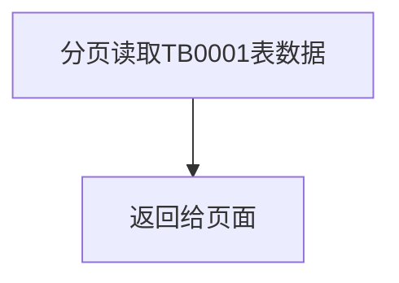
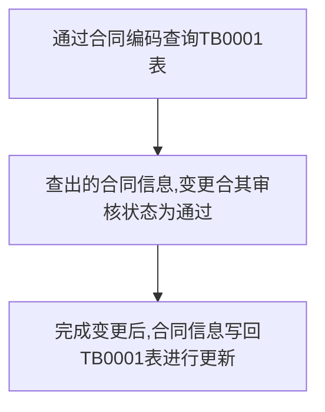
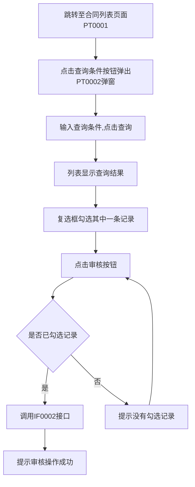

# 需求规格说明书模板

## 文档信息

| 项目名称 | 【需求名称】     |
| ---- | ---------- |
| 文档版本 | V1.0       |
| 作者   | 孔镇浩        |
| 创建日期 | 2025-04-10 |
| 状态   | 已确认        |

## 变更履历

| 版本   | 日期         | 变更描述 | 修订人 | 审核  |
| ---- | ---------- | ---- | --- | --- |
| V1.0 | 2025-04-10 | 初次编写 | 孔镇浩 | 通过  |

## 1. 需求概述

### 1.1 需求背景

先忽略

### 1.2 需求目标

先忽略

### 1.3 需求范围

先忽略

### 1.4 相关干系人

| 角色    | 部门  | 姓名  | 职责  |
| ----- | --- | --- | --- |
| 产品负责人 |     |     |     |
| 业务负责人 |     |     |     |
| 技术负责人 |     |     |     |

## 2. 业务架构

### 2.1 业务模块关系图

无

### 2.2 模块列表

| 模块编号   | 模块名称 | 模块英文名               | 英文缩写 |
| ------ | ---- | ------------------- | ---- |
| MD0001 | 合同管理 | contract management | ctm  |

### 2.3 数据模型

#### 2.3.1 久期模块

##### 2.3.1.1 表间关系

##### 2.3.1.2 表名字典

| 表编号    | 表中文名 | 表英文名                | 备注  |
| ------ | ---- | ------------------- | --- |
| TB0001 | 合同信息 | t_ctm_contract_info |     |

##### 2.3.1.3 表集

**（1）TB0001**

| 字段名                   | 数据类型    | 长度  | 允许空 | 唯一索引 | 默认值 | 说明                        |
| --------------------- | ------- | --- | --- | ---- | --- | ------------------------- |
| contract_code         | varchar | 20  | 否   | 是    | 无   | 合同编码，格式为CTT0000001        |
| contract_name         | varchar | 100 | 否   | 否    | 无   | 合同名称                      |
| contract_desc         | varchar | 100 | 否   | 否    | 无   | 合同摘要                      |
| contract_type         | varchar | 2   | 否   | 否    | 无   | 合同类型，01:普通合同，02:高级合同      |
| contract_url          | varchar | 100 | 否   | 否    | 无   | 合同下载URL地址                 |
| contract_price        | int     | 20  | 否   | 否    | 无   | 合同价格                      |
| contract_plan         | varchar | 100 | 否   | 否    | 无   | 合同执行计划                    |
| contract_party        | varchar | 100 | 否   | 否    | 无   | 签约主体                      |
| contract_total_amount | int     | 20  | 否   | 否    | 无   | 合同总金额                     |
| company_code          | varchar | 20  | 否   | 否    | 无   | 管理机构编码，格式为CMP0000001      |
| bank_channel_code     | varchar | 20  | 否   | 否    | 无   | 银行渠道编码，格式为BNK0000001      |
| pay_year              | int     | 2   | 否   | 否    | 无   | 缴费年期                      |
| audit_stuts           | int     | 2   | 否   | 否    | 01  | 核审状态，01:未通过，02:通过         |
| channel_name          | varchar | 100 | 否   | 否    | 无   | 渠道名称                      |
| product_name          | varchar | 100 | 否   | 否    | 无   | 产品名称                      |
| period                | int     | 2   | 否   | 否    | 无   | 保障期间                      |
| valid_start_time      | date    |     | 否   | 否    | 无   | 有效起期，格式为YYYY-MM-DD        |
| valid_end_time        | date    |     | 否   | 否    | 无   | 有效止期，格式为YYYY-MM-DD        |
| department            | varchar | 20  | 否   | 否    | 无   | 业务部门，01:财务部，02:人事部，03:开发部 |
| payment_type          | varchar | 2   | 否   | 否    | 无   | 缴费方式，01:银行卡，02:微信，03:支付室  |
| ratio_type            | varchar | 2   | 否   | 否    | 无   | 比例类型，01:小，02:中，03:高       |

### 2.4 用例列表

| 用例编号   | 用例名称   | 用例描述 | 模块编号   |
| ------ | ------ | ---- | ------ |
| UC0001 | 合同信息审核 |      | MD0001 |

### 2.5 接口清单

| 接口编号   | 接口名称   | 接口描述 | 模块编号   |
| ------ | ------ | ---- | ------ |
| IF0001 | 查询合同信息 |      | MD0001 |
| IF0002 | 审核合同信息 |      | MD0001 |

## 3. 业务概念与术语

| 术语  | 定义  | 业务含义 | 备注  |
| --- | --- | ---- | --- |
|     |     |      |     |

## 4. 功能需求

### 4.1 合同管理模块（MD0001）

#### 4.1.1 原型图

#### 4.1.1.1 合同信息查询

##### 4.1.1.1.1 原型图

PT0001：


PT0002：


##### 4.1.1.1.2 查询条件

| 字段名  | 字段类型 | 格式    | 备注                   |
| ---- | ---- | ----- | -------------------- |
| 业务部门 | 下拉框  | 长度20  | 01:财务部，02:人事部，03:开发部 |
| 合同名称 | 输入框  | 长度100 |                      |
| 合同编码 | 输入框  | 长度20  | 无                    |

##### 4.1.1.1.3 列表展示

| 字段名      | 字段类型 | 格式    | 备注              |
| -------- | ---- | ----- | --------------- |
| 合同编码     | 文本   | 长度20  | 合同编码            |
| 合同名称     | 文本   | 长度20  |                 |
| 合同摘要     | 文本   | 长度100 |                 |
| 合同类型     | 下拉框  | 长度20  | 01:普通合同，02:高级合同 |
| 合同文件下载   | 下载链接 | 长度100 | URL地址链接         |
| 合同价格信息   | 数值   | 长度10  |                 |
| 合同执行计划信息 | 文本   | 长度100 |                 |
| 合同总金额    | 数值   | 长度10  |                 |

##### 4.1.1.1.4 其他描述

按钮包括添加、删除、导出、导入、同步档案、同步费控、查询条件、查询、审核

#### 4.1.2 接口功能

##### 4.1.2.1 查询合同信息(FN0001)

##### 4.1.2.1.1 接口功能概述

查询合同信息

##### 4.1.2.1.2 接口基本信息

| 类型           | 描述                   |
| ------------ | -------------------- |
| Method       | GET                  |
| Content-Type | multipart/form-data  |
| Url          | /ctm/getContractList |

##### 4.1.2.1.3 接口入参

无

##### 4.1.2.1.4 接口出参

| 参数名                   | 类型       | 描述                        |
| --------------------- | -------- | ------------------------- |
| code                  | number   | 代码为200为成功,反则异常            |
| msg                   | string   | 异常描述                      |
| data                  | Object[] | 数据                        |
| - contractCode        | string   | 合同编码，格式为CTT0000001        |
| - contractName        | string   | 合同名称                      |
| - contractDesc        | string   | 合同摘要                      |
| - contractType        | string   | 合同类型，01:普通合同，02:高级合同      |
| - contractUrl         | string   | 合同下载URL地址                 |
| - contractPrice       | number   | 合同价格                      |
| - contractPlan        | string   | 合同执行计划                    |
| - contractParty       | string   | 签约主体                      |
| - contractTotalAmount | number   | 合同总金额                     |
| - companyCode         | string   | 管理机构编码，格式为CMP0000001      |
| - bankChannelCode     | string   | 银行渠道编码，格式为BNK0000001      |
| - payYear             | number   | 缴费年期                      |
| - auditStuts          | number   | 核审状态，01:未通过，02:通过         |
| - channelName         | string   | 渠道名称                      |
| - productName         | string   | 产品名称                      |
| - period              | number   | 保障期间                      |
| - validStartTime      | string   | 有效起期，格式为YYYY-MM-DD        |
| - validEndTime        | string   | 有效止期，格式为YYYY-MM-DD        |
| - department          | string   | 业务部门，01:财务部，02:人事部，03:开发部 |
| - paymentType         | string   | 缴费方式，01:银行卡，02:微信，03:支付室  |
| - ratioType           | string   | 比例类型，01:小，02:中，03:高       |
| 成功示例:                 |          |                           |

```json
{
    "code": 200,
    "msg": "",
    "data": [
        {
            "contractCode": "CTT0000001",
            "contractName": "XXX",
            "contractDesc": "XXX",
            "contractType": "01",
            "contractUrl": "https://www.baidu.com/aaa",
            "contractPrice": 100,
            "contractPlan": "fafdaf",
            "contractParty": "yyyy",
            "contractTotalAmount": 1000,
            "companyCode": "CMP0000001",
            "bankChannelCode": "BNK0000001",
            "payYear": 2,
            "auditStuts": "01",
            "channelName": "FAFDA",
            "productName": "LLL",
            "period": 2,
            "validStartTime": "2025-01-01",
            "validEndTime": "2025-05-01",
            "department": "01",
            "paymentType": "01",
            "ratioType": "01"
        },
        {
            "contractCode": "CTT0000002",
            "contractName": "YYY",
            "contractDesc": "YYY",
            "contractType": "01",
            "contractUrl": "https://www.baidu.com/bbb",
            "contractPrice": 100,
            "contractPlan": "fafdaf",
            "contractParty": "yyyy",
            "contractTotalAmount": 1000,
            "companyCode": "CMP0000001",
            "bankChannelCode": "BNK0000002",
            "payYear": 2,
            "auditStuts": "01",
            "channelName": "FAFDA",
            "productName": "LLL",
            "period": 2,
            "validStartTime": "2025-01-01",
            "validEndTime": "2025-05-01",
            "department": "01",
            "paymentType": "01",
            "ratioType": "01"
        }
    ]
}
```

失败示例:

```json
{
    "code": 500,
    "msg": "系统异常,请联系管理员!"
}
```

##### 4.1.2.1.5 接口功能详述



##### 4.1.2.2 审核合同信息(IF0002)

##### 4.1.2.2.1 接口功能概述

审核合同信息

##### 4.1.2.2.2 接口基本信息

| 类型           | 描述                     |
| ------------ | ---------------------- |
| Method       | POST                   |
| Content-Type | multipart/form-data    |
| Url          | /ctm/auditContractInfo |

##### 4.1.2.2.3 接口入参

| 参数名          | 类型     | 是否必填 | 描述   |
| ------------ | ------ | ---- | ---- |
| contractCode | String | 是    | 合同编码 |

##### 4.1.2.2.4 接口出参

| 参数名  | 类型     | 描述             |
| ---- | ------ | -------------- |
| code | Long   | 代码为200为成功,反则异常 |
| msg  | String | 异常描述           |

成功示例:

```json
{
    "code": 200,
    "msg": ""
}
```

失败示例:

```json
{
    "code": 500,
    "msg": "系统异常,请联系管理员!"
}
```

##### 4.1.2.2.5 接口功能详述



#### 4.1.3 功能描述

##### 4.1.3.1 合同审核（FN0001）

##### 4.1.3.1.1 功能概要

审核合同

##### 4.1.3.1.2 业务总流程

##### 4.1.3.1.3 用例描述

##### 4.1.3.1.3.1 合同信息审核(UC0001)

| 用例标识 | 用例描述          |
|:----:| ------------- |
| 类型   | 服务            |
| 用例名称 | 合同信息查询        |
| 功能描述 | 合同信息查询        |
| 参与者  | 财务部人员         |
| 原型图  | PT0001,PT0002 |
| 关联表  | TB0001        |
| 前置用例 |               |




